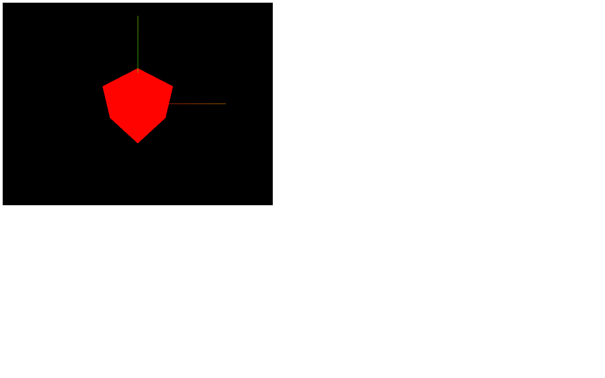

# Transforms objects

[](https://shields.io)

Learn in [https://threejs-journey.xyz/lessons/5](https://threejs-journey.xyz/lessons/5)

## Introduction

Now that we have everything in place, we can explore Three.js functionalities.

Before animating our scene, we need to know how to transform objects in our scene. We've already done that with the camera by moving it backward using the `camera.position.z = 3`.

There are 4 properties to transform objects in our scene

- `position` (to move the object)
- `scale` (to resize the object)
- `rotation` (to rotate the object)
- `quaternion` (to also rotate the object; more about that later)

All classes that inherit from the [Object3D](https://threejs.org/docs/#api/en/core/Object3D) class possess those properties like [PerspectiveCamera](https://threejs.org/docs/#api/en/cameras/PerspectiveCamera) or [Mesh](https://threejs.org/docs/#api/en/objects/Mesh) and classes that we haven't covered yet.

You can see from what classes inherit each class on top of the Three.js documentation.

Those properties will be compiled in what we call matrices. Matrices are used internally by Three.js, by the WebGL, and by the GPU to transform things. Fortunately, you don't have to handle matrices by yourself and you can just modify the previously-mentioned properties.

## Setup

In the starter, all we have is the project how we left it in the previous lesson with the cube in the center of the view.


## Move objects

The `position` possesses 3 essential properties, which are `x`, `y`, and `z`. Those are the 3 necessary axes to position something in a 3D space.

The direction of each axis is purely arbitrary, and it can vary according to the environment. In Three.js, we usually consider that the `y` axis is going upward, the `z` axis is going backward, and the `x` axis is going to the right.

As for the meaning of `1` unit, it's up to you. `1` can be 1 centimeter, 1 meter, or even 1 kilometer. I recommend that you adapt the unit to what you want to build. If you're going to create a house, you probably should think of `1` unit as 1 meter.

You can play around with the `position` property of your `mesh` and try to guess where the cube will get (try to keep it in the screen).

Make sure to do that before you call the `render(...)` method or you will render the `mesh` before moving it.

```js
mesh.position.x = 0.7
mesh.position.y = - 0.6
mesh.position.z = 1
```


The `position` property is not any object. It's an instance of the [Vector3](https://threejs.org/docs/#api/en/math/Vector3) class. While this class has an `x`, a `y`, and a `z` property, it also has many useful methods.

You can get the length of a vector:

```js
console.log(mesh.position.length())
```

You can get the distance from another [Vector3](https://threejs.org/docs/#api/en/math/Vector3) (make sure to use this code after creating the camera):

```js
console.log(mesh.position.distanceTo(camera.position))
```

You can normalize its values (meaning that you will reduce the length of the vector to `1` unit but preserve its direction):

```js
console.log(mesh.position.normalize())
```

To change the values, instead of changing `x`, `y` and `z` separately, you can also use the `set(...)` method:

```js
mesh.position.set(0.7, - 0.6, 1)
```

## Axes helper

Before we go any further, as you can see, positioning things in space can be a real challenge. Knowing where each axis is oriented is complicated especially when we start to move the camera.

One good solution is to use the Three.js [AxesHelper](https://threejs.org/docs/#api/en/helpers/AxesHelper).

The [AxesHelper](https://threejs.org/docs/#api/en/helpers/AxesHelper) will display 3 lines corresponding to the `x`, `y` and `z` axes, each one starting at the center of the scene and going in the corresponding direction.

To create the [AxesHelper](https://threejs.org/docs/#api/en/helpers/AxesHelper), instantiate it and add it to the `scene` right after instantiating that `scene`. You can specify the length of the lines as the only parameter. We are going to use `2`:

```js
/**
 * Axes Helper
 */
const axesHelper = new THREE.AxesHelper(2)
scene.add(axesHelper)
```


You should see a **green** and a **red** line.

The **green** line corresponds to the `y` axis. The **red** line corresponds to the `x` axis and there is a **blue** line corresponding to the `z` axis but we can't see it because it's perfectly aligned with the camera.

We won't use this [AxesHelper](https://threejs.org/docs/#api/en/helpers/AxesHelper) in the next lessons but feel free to add it if you need a visual reference.

## Scale objects

`scale` is also a [Vector3](https://threejs.org/docs/#api/en/math/Vector3). By default, `x`, `y` and `z` are equal to `1`, meaning that the object has no scaling applied. If you put `0.5` as a value, the object will be half of its size on this axis, and if you put `2` as a value, it will be twice its original size on this axis.

If you change those values, the object will start to scale accordingly. Comment the `position` and add these scales:

```js
mesh.scale.x = 2
mesh.scale.y = 0.25
mesh.scale.z = 0.5
```


Clearly, we cannot see the `z` scale because our [Mesh](https://threejs.org/docs/#api/en/objects/Mesh) is facing the camera.

While you can use negative values, it might generate bugs later on because axes won't be oriented in the logical direction. Try to avoid doing it.

Because it's a [Vector3](https://threejs.org/docs/#api/en/math/Vector3), we can use all the previously mentioned methods.

## Rotate objects

Rotation is a little more troublesome than `position` and `scale`. There are two ways of handling a rotation.

You can use the self-evident `rotation` property, but you can also use the less obvious `quaternion` property. Three.js supports both, and updating one will automatically update the other. It's just a matter of which one you prefer.

#### Rotation

The `rotation` property also has `x`, `y`, and `z` properties, but instead of a [Vector3](https://threejs.org/docs/#api/en/math/Vector3), it's a [Euler](https://threejs.org/docs/index.html#api/en/math/Euler). When you change the `x`, `y`, and `z` properties of a [Euler](https://threejs.org/docs/index.html#api/en/math/Euler), you can imagine putting a stick through your object's center in the axis's direction and then rotating that object on that stick.

- If you spin on the `y` axis, you can picture it like a carousel.
- If you spin on the `x` axis, you can imagine that you are rotating the wheels of a car you'd be in.
- And if you rotate on the `z` axis, you can imagine that you are rotating the propellers in front of an aircraft you'd be in.

The value of these axes is expressed in radians. If you want to achieve half a rotation, you'll have to write something like 3.14159... You probably recognize that number as π. In native JavaScript, you can end up with an approximation of π using `Math.PI`.

Comment the `scale` and add an eighth of a complete rotation in both `x` and `y` axes:

```js
mesh.rotation.x = Math.PI * 0.25
mesh.rotation.y = Math.PI * 0.25
```



Is it easy? Yes, but when you combine those rotations, you might end up with strange results. Why? Because, while you rotate the `x` axis, you also change the other axes' orientation. The rotation applies in the following order: `x`, `y`, and then `z`. That can result in weird behaviors like one named gimbal lock when one axis has no more effect, all because of the previous ones.

We can change this order by using the `reorder(...)` method `object.rotation.reorder('yxz')`

While [Euler](https://threejs.org/docs/index.html#api/en/math/Euler) is easier to understand, this order problem can cause issues. And this is why most engines and 3D softwares use another solution named [Quaternion](https://threejs.org/docs/#api/en/math/Quaternion).

#### Quaternion

The `quaternion` property also expresses a rotation, but in a more mathematical way, which solves the order problem.

We will not cover how quaternions work in this lesson but keep in mind that the `quaternion` updates when you change the `rotation`. This means that you can use any one of the two as you please.

#### Look at this!

[Object3D](https://threejs.org/docs/#api/en/core/Object3D) instances have an excellent method named `lookAt(...)` that lets you ask an object to look at something. The object will automatically rotate its `-z` axis toward the target you provided. No complicated maths needed.

You can use it to rotate the camera toward an object, orientate a cannon to face an enemy, or move the character's eyes to an object.

The parameter is the target and must be a [Vector3](https://threejs.org/docs/#api/en/math/Vector3). You can create one just to try it:

```js
camera.lookAt(new THREE.Vector3(0, - 1, 0))
```


The cube seems to be higher, but in fact, the camera is looking below the cube.

We can also use any existing [Vector3](https://threejs.org/docs/#api/en/math/Vector3) such as the `mesh`'s `position`, but that will result in the default camera position because our `mesh` is in the center of the `scene`.

```js
camera.lookAt(mesh.position)
```

## Combining transformations

You can combine the `position`, the `rotation` (or `quaternion`), and the `scale` in any order. The result will be the same. It's equivalent to the state of the object.

Let's combine all the transformations we tried before:

```js
mesh.position.x = 0.7
mesh.position.y = - 0.6
mesh.position.z = 1
mesh.scale.x = 2
mesh.scale.y = 0.25
mesh.scale.z = 0.5
mesh.rotation.x = Math.PI * 0.25
mesh.rotation.y = Math.PI * 0.25
```


## Scene graph

At some point, you might want to group things. Let's say you are building a house with walls, doors, windows, a roof, bushes, etc.

When you think you're done, you become aware that the house is too small, and you have to re-scale each object and update their positions.

A good alternative would be to group all those objects into a container and scale that container.

You can do that with the [Group](https://threejs.org/docs/#api/en/objects/Group) class.

Instantiate a [Group](https://threejs.org/docs/#api/en/objects/Group) and add it to the scene. Now, when you want to create a new object, you can add it to the [Group](https://threejs.org/docs/#api/en/objects/Group) you just created using the `add(...)` method rather than adding it directly to the scene

Because the [Group](https://threejs.org/docs/#api/en/objects/Group) class inherits from the [Object3D](https://threejs.org/docs/#api/en/core/Object3D) class, it has access to the previously-mentioned properties and methods like `position`, `scale`, `rotation`, `quaternion`, and `lookAt`.

Comment the `lookAt(...)` call and, instead of our previously created cube, create 3 cubes and add them to a [Group](https://threejs.org/docs/#api/en/objects/Group). Then apply transformations on the `group`:

```js
/**
 * Objects
 */
const group = new THREE.Group()
group.scale.y = 2
group.rotation.y = 0.2
scene.add(group)

const cube1 = new THREE.Mesh(
    new THREE.BoxGeometry(1, 1, 1),
    new THREE.MeshBasicMaterial({ color: 0xff0000 })
)
cube1.position.x = - 1.5
group.add(cube1)

const cube2 = new THREE.Mesh(
    new THREE.BoxGeometry(1, 1, 1),
    new THREE.MeshBasicMaterial({ color: 0xff0000 })
)
cube2.position.x = 0
group.add(cube2)

const cube3 = new THREE.Mesh(
    new THREE.BoxGeometry(1, 1, 1),
    new THREE.MeshBasicMaterial({ color: 0xff0000 })
)
cube3.position.x = 1.5
group.add(cube3)
```


The order doesn't really matter, as long as it's valid JavaScript.

Now that we know how to transform objects, it's time to create some animations.
