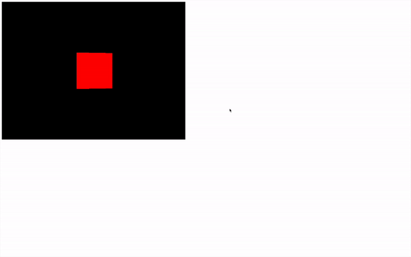
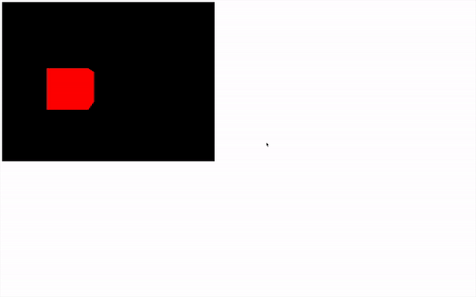
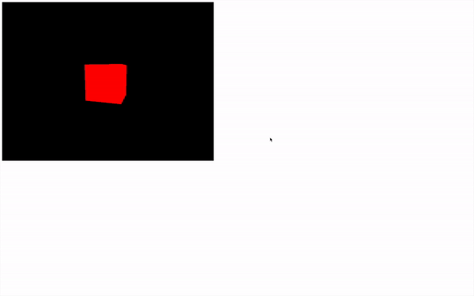

# Animations

[](https://shields.io)

Learn in [https://threejs-journey.xyz/lessons/6](https://threejs-journey.xyz/lessons/6)

## Introduction

We created a scene that we rendered once at the end of our code. That is already good progress, but most of the time, you'll want to animate your creations.

Animations, when using Three.js, work like stop motion. You move the objects, and you do a render. Then you move the objects a little more, and you do another render. Etc. The more you move the objects between renders, the faster they'll appear to move.

The screen you are looking at runs at a specific frequency. We call that a frame rate. The frame rate mostly depends on the screen, but the computer itself has limitations. Most screens run at 60 frames per second. If you do the maths, that means about a frame every 16ms. But some screens can run much faster, and when the computer has difficulties processing things, it'll run more slowly.

We want to execute a function that will move objects and do the render on each frame regardless of the frame rate.

The native JavaScript way of doing so is by using the `window.requestAnimationFrame(...)` method.

## Setup

As we had before, all we have in the starter is our cube in the scene's center.


## Using requestAnimationFrame

The primary purpose of [requestAnimationFrame](https://developer.mozilla.org/docs/Web/API/window/requestAnimationFrame) is not to run code on each frame.

`requestAnimationFrame` will execute the function you provide **on the next frame**. But then, if this function also uses `requestAnimationFrame` to execute that same function on the next frame, you'll end up with your function being executed on each frame forever which is exactly what we want.

Create a function named `tick` and call this function once. In this function, use `window.requestAnimationFrame(...)` to call this same function on the next frame:

```js
/**
 * Animate
 */
const tick = () =>
{
    console.log('tick')

    window.requestAnimationFrame(tick)
}

tick()
```

That's it. You have your infinite loop.

As you can see on the console, the `'tick'` is being called on each frame. If you test this code on a computer with a high frame rate, the `'tick'` will appears at a higher frequency.

You can now move the `renderer.render(...)` call inside that function and increase the cube `rotation`:

```js
/**
 * Animate
 */
const tick = () =>
{
    // Update objects
    mesh.rotation.y += 0.01

    // Render
    renderer.render(scene, camera)

    // Call tick again on the next frame
    window.requestAnimationFrame(tick)
}

tick()
```


_https://threejs-journey.xyz/assets/lessons/06/step-02.mp4_

Congratulations, you now have a Three.js animation.

The problem is, if you test this code on a computer with high frame rate, the cube will rotate faster, and if you test on a lower frame rate, the cube will rotate slower.

#### Adaptation to the framerate

To adapt the animation to the framerate, we need to know how much time it's been since the last tick.

First, we need a way to measure time. In native JavaScript, you can use `Date.now()` to get the current timestamp:

```js
const time = Date.now()
```

The timestamp corresponds to how much time has passed since the 1st of January 1970 (the beginning of time for Unix). In JavaScript, its unit is in milliseconds.

What you need now is to subtract the current timestamp to that of the previous frame to get what we can call the `deltaTime` and use this value when animating objects:

```js
/**
 * Animate
 */
let time = Date.now()

const tick = () =>
{
    // Time
    const currentTime = Date.now()
    const deltaTime = currentTime - time
    time = currentTime

    // Update objects
    mesh.rotation.y += 0.01 * deltaTime

    // ...
}

tick()
```



_https://threejs-journey.xyz/assets/lessons/06/step-03.mp4_

The cube should rotate faster because the deltaTime should be around `16` if your screen is running at `60fps`, so feel free to reduce it by multiplying the value.

Now that we base our rotation on how much time was spent since the last frame, this rotation speed will be the same on every screen and every computers regardless of the frame rate.

## Using Clock

While this code isn't that complicated, there is a built-in solution in Three.js named [Clock](https://threejs.org/docs/#api/en/core/Clock) that will handle the time calculations.

You simply have to instantiate a [Clock](https://threejs.org/docs/#api/en/core/Clock) variable and use the built-in methods like `getElapsedTime()`. This method will return how many seconds have passed since the [Clock](https://threejs.org/docs/#api/en/core/Clock) was created.

You can use this value to rotate the object:

```js
/**
 * Animate
 */
const clock = new THREE.Clock()

const tick = () =>
{
    const elapsedTime = clock.getElapsedTime()

    // Update objects
    mesh.rotation.y = elapsedTime

    // ...
}

tick()
```


_https://threejs-journey.xyz/assets/lessons/06/step-04.mp4_

You can also use it to move things with the `position` property. If you combine it with `Math.sin(...)` you can get a pretty good result:

```js
/**
 * Animate
 */
const clock = new THREE.Clock()

const tick = () =>
{
    const elapsedTime = clock.getElapsedTime()

    // Update objects
    mesh.position.x = Math.cos(elapsedTime)
    mesh.position.y = Math.sin(elapsedTime)

    // ...
}

tick()
```



_https://threejs-journey.xyz/assets/lessons/06/step-05.mp4_

And obviously, you can use those techniques to animate any [Object3D](https://threejs.org/docs/#api/en/core/Object3D) like the camera:

```js
/**
 * Animate
 */
const clock = new THREE.Clock()

const tick = () =>
{
    const elapsedTime = clock.getElapsedTime()

    // Update objects
    camera.position.x = Math.cos(elapsedTime)
    camera.position.y = Math.sin(elapsedTime)
    camera.lookAt(mesh.position)

    // ...
}

tick()
```



_https://threejs-journey.xyz/assets/lessons/06/step-06.mp4_

Another available method is `getDelta(...)`, but you should not use it unless you know exactly what's going on in the [Clock](https://threejs.org/docs/#api/en/core/Clock) class code. Using it might mess with your animation, and you'll get unwanted results.

## Using a library

Sometimes you'll want to animate your scene in a very specific way that will require using another library. There are tons of animation libraries, but a very famous is [GSAP](https://greensock.com/gsap/).

To add GSAP to our Webpack project, we can use the dependency manager provided with Node.js called `npm`.

In your terminal (while the server is not running or by using another terminal window on the same folder), run `npm install --save gsap@3.5.1`

The `--save` argument saves the dependency in the `package.json` so the module can be fetched if we do an `npm install`.

The `@3.5.1` forces the version. We use this version because it was the one used when writing the lesson, but you can try the latest version if you want by removing `@3.5.1`.

GSAP is now available in the `node_modules/` folder, and we can import it in our `script.js`:

```js
import './style.css'
import * as THREE from 'three'
import gsap from 'gsap'

// ...
```

There are many ways of using GSAP, and we could dedicate an entire course to it, but it is not the goal of this course. We will simply create a tween to test things out. If you already know how to use GSAP, it works the same with Three.js.

Comment the code related to the previous animations but keep the `tick` function with the render. Then you can create what we call a tween (an animation from A to B) using `gsap.to(...)`:

```js
/**
 * Animate
 */
gsap.to(mesh.position, { duration: 1, delay: 1, x: 2 })

const tick = () =>
{
    // Render
    renderer.render(scene, camera)

    // Call tick again on the next frame
    window.requestAnimationFrame(tick)
}

tick()
```


_https://threejs-journey.xyz/assets/lessons/06/step-07.mp4_

GSAP has a built-in `requestAnimationFrame`, so you don't need to update the animation by yourself, but still, if you want to see the cube moving, you need to keep doing the renders of your scene on each frame.

## Choosing the right solution

As for choosing between native JS and an animation library, it's a matter of what you want to achieve. If you're going to create a carousel that spins forever, you don't need any library for that. But if you want to animate, for instance, the swing of a sword, you might prefer to use a library.
