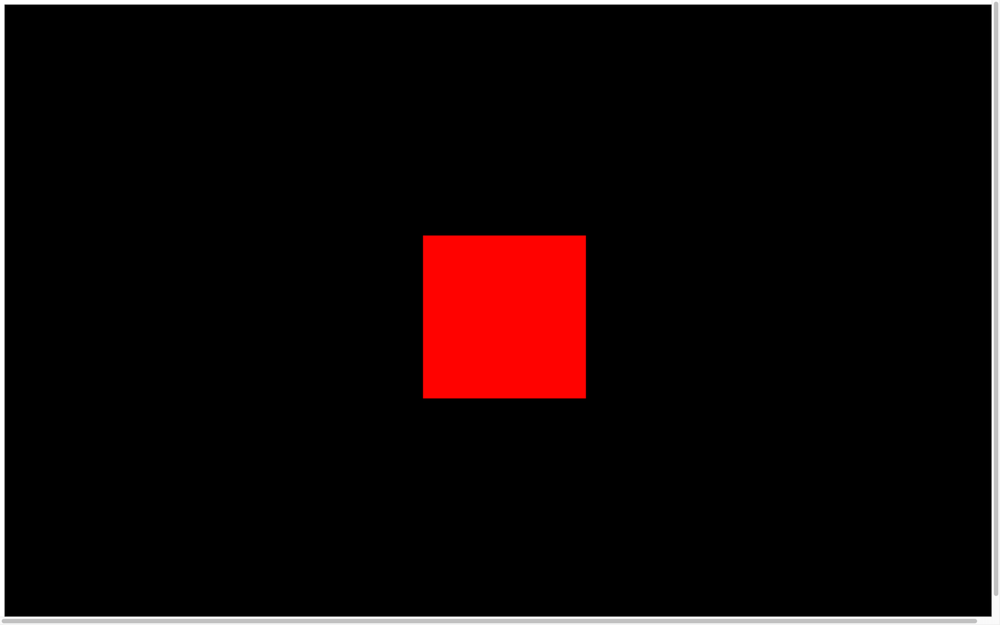
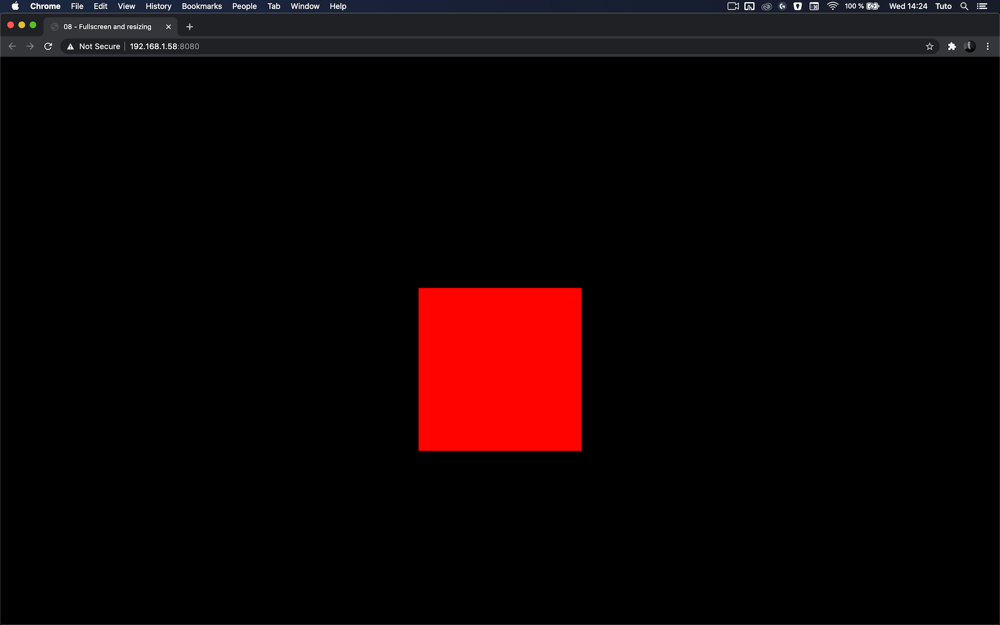
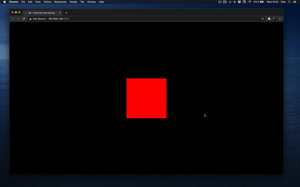
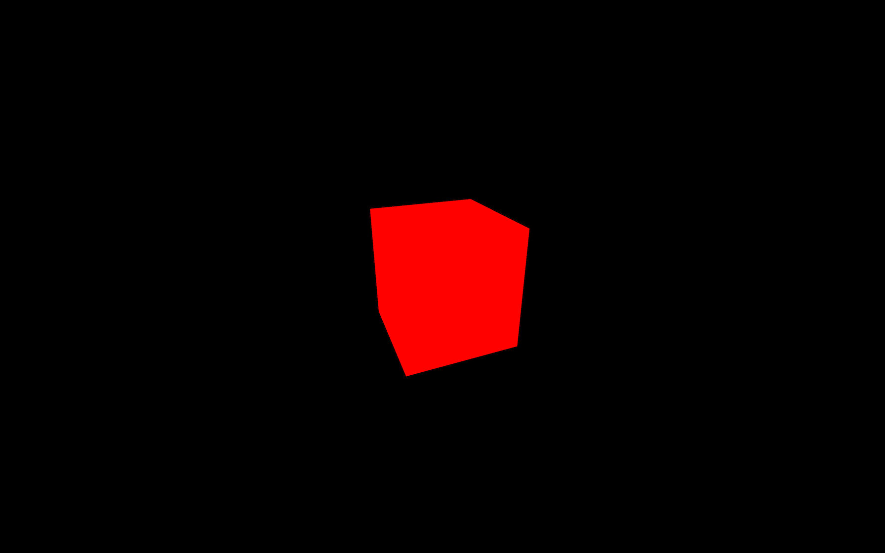
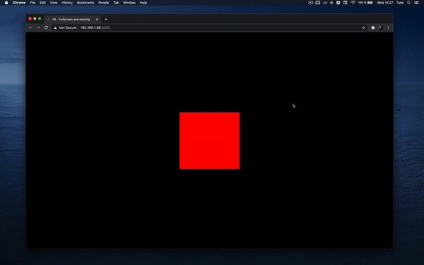

# Fullscreen and resizing

[](https://shields.io)

Learn in [https://threejs-journey.xyz/lessons/8](https://threejs-journey.xyz/lessons/8)

## Introduction

Our canvas currently has a fixed resolution of `800x600`. You don't necessarily need your WebGL to fit the whole screen, but if you want an immersive experience, it might be better.

First, we would like to have the canvas take all available space. Then, we need to make sure that it still fits if the user resizes their window. Finally, we need to give the user a way to experiment with the experience in fullscreen.

## Setup

The starter contains what we finished within the previous lesson. We have our cube in the center, and we can drag and drop to move the camera.


## Fit in the viewport

To make the canvas fit perfectly in the viewport, instead of using fixed numbers in the `sizes` variable, use the `window.innerWidth` and `window.innerHeight`:

```js
// ...

// Sizes
const sizes = {
    width: window.innerWidth,
    height: window.innerHeight
}

// ...
```



You can see that the canvas now has the width and height of the viewport. Unfortunately, there is a white margin and a scroll bar (try to scroll if you don't see any scrollbar).

The problem is that browsers all have default stylings like more significant titles, underlined links, space between paragraphs, and paddings on the page. There are many ways of fixing that, and it might depend on the rest of your website. If you have other content, try not to break any of those while doing this.

We will keep things simple and fix the position of the canvas using CSS.

Our template is already linked to a CSS file in `src/style.css`. It might look strange if you are not used to Webpack, but the CSS file is directly imported from `script.js` on the first line:

```js
import './style.css'
```

You can write standard CSS just like you're used to, and the page will automatically reload.

A good thing to do first would be to remove any type of `margin` or `padding` on all elements by using a wildcard `*`:

```css
*
{
    margin: 0;
    padding: 0;
}
```

Then, we can fix the canvas on the top left using its `webgl` class to select it:

```css
.webgl
{
    position: fixed;
    top: 0;
    left: 0;
}
```

You don't need to specify `width` or `height` on the canvas because Three.js is already taking care of that when you call the `renderer.setSize(...)` method.

This is a good opportunity to fix a small problem on our canvas. Maybe you've noticed a blue outline on it when drag and dropping. This mostly happens on latest versions of Chrome. To fix that, we can simply add an `outline: none;` on the `.webgl`:

```css
.webgl
{
    position: fixed;
    top: 0;
    left: 0;
    outline: none;
}
```

If you want to remove any type of scrolling even on touch screens, you can add an `overflow: hidden` on both `html` and `body`:

```css
html,
body
{
    overflow: hidden;
}
```



You can now enjoy your WebGL in all its glory. Unfortunately, if you resize the window, the canvas won't follow.

We need to deal with the resize.

## Handle resize

To resize the canvas, we first need to know when the window is being resized. To do so, you can listen to the `resize` event on window.

Add the `resize` listener right after the `sizes` variable:

```js
window.addEventListener('resize', () =>
{
    console.log('window has been resized')
})
```

Now that we trigger a function when the window is being resized, we need to update few things in our code.

First, we must update the `sizes` variable:

```js
window.addEventListener('resize', () =>
{
    // Update sizes
    sizes.width = window.innerWidth
    sizes.height = window.innerHeight
})
```

Secondly, we must update the `camera` aspect ratio by changing its `aspect` property:

```js
window.addEventListener('resize', () =>
{
    // ...

    // Update camera
    camera.aspect = sizes.width / sizes.height
})
```

When you change camera properties like `aspect` you also need to update the projection matrix using `camera.updateProjectionMatrix()`. We will talk about matrices later:

```js
window.addEventListener('resize', () =>
{
    // ...

    camera.updateProjectionMatrix()
})
```

Finally, we must update the `renderer`. Updating the renderer will automatically update the canvas width and height:

```js
window.addEventListener('resize', () =>
{
    // ...

    // Update renderer
    renderer.setSize(sizes.width, sizes.height)
})
```

All together:

```js
window.addEventListener('resize', () =>
{
    // Update sizes
    sizes.width = window.innerWidth
    sizes.height = window.innerHeight

    // Update camera
    camera.aspect = sizes.width / sizes.height
    camera.updateProjectionMatrix()

    // Update renderer
    renderer.setSize(sizes.width, sizes.height)
})
```



_https://threejs-journey.xyz/assets/lessons/08/step-04.mp4_

You can resize the window as you want, the canvas should cover the viewport without any scroll bar or overflow.

## Handle pixel ratio

Some of you might see a kind of blurry render and artifacts shaped likes stairs on the edges (called aliasing), but not all of you. If you do, it's because you are testing on a screen with a pixel ratio greater than `1`.

The pixel ratio corresponds to how many physical pixels you have on the screen for one pixel unit on the software part.

#### Some history

A few years ago, all screens had a pixel ratio of `1` and everything was just fine. But when you looked closely at your screen, you could see those pixels, and it was a limitation for how precise images and how thin fonts could be.

The company that did the most about that was Apple. Apple saw an opportunity and started constructing screens with a pixel ratio of `2` called retina. Now, a lot of constructors are doing it and you can see screens with even higher pixel ratios.

While this is a good thing for the image quality, a pixel ratio of `2` means 4 times more pixels to render. And a pixel ratio of `3` means 9 times more pixels to render.

And guess what? Highest pixel ratios are usually on the weakest devices —mobiles ones.

There goes your frame rate.

#### Handle the pixel ratio

To get the screen pixel ratio you can use `window.devicePixelRatio` , and to update the pixel ratio of your renderer, you simply need to call the `renderer.setPixelRatio(...)`

You might be tempted to simply send the device pixel ratio to that method, but you'll end up with performance issues on high pixel ratio devices.

Having a pixel ratio greater than `2` is mostly marketing. Your eyes will see almost no difference between `2` and `3` but it will create performance issues and empty the battery faster. What you can do is limit the pixel ratio to `2`. To do that, you can use `Math.min()`:

```js
renderer.setPixelRatio(Math.min(window.devicePixelRatio, 2))
```



There are techniques to be notified when the pixel ratio changes, but it only concerns users having multiple screens with different pixel ratios and they usually resize their window when changing from a screen to another. That is why we will simply add this method to the `resize` callback too:

```js
window.addEventListener('resize', () =>
{
    // Update sizes
    sizes.width = window.innerWidth
    sizes.height = window.innerHeight

    // Update camera
    camera.aspect = sizes.width / sizes.height

    // Update renderer
    renderer.setSize(sizes.width, sizes.height)
    renderer.setPixelRatio(Math.min(window.devicePixelRatio, 2))
})
```

## Handle fullscreen

Now that we have the canvas taking all the available space with the right pixel ratio, it's time to add support to the fullscreen.

First, we need to decide what action will trigger the fullscreen mode. It could be an HTML button, but instead, we're going to use a double click.

When the double click happens, we will toggle the fullscreen —meaning that if the window is not in fullscreen, a double-click will enable fullscreen mode, and if the window is already in fullscreen, a double-click will exit fullscreen mode.

First, we need to listen to the double click event, and we can do that with the `dblclick` event:

```js
window.addEventListener('dblclick', () =>
{
    console.log('double click')
})
```

This event will work on most modern browsers except for Chrome Android: [https://developer.mozilla.org/docs/Web/API/Element/dblclick_event](https://developer.mozilla.org/docs/Web/API/Element/dblclick_event)

Now that we have our event, we need 3 things:

- A way to know if it's already in fullscreen
- A method to go to the fullscreen mode
- A method to leave the fullscreen mode

To know if we are already in fullscreen or not, we can use `document.fullscreenElement`:

```js
window.addEventListener('dblclick', () =>
{
    if(!document.fullscreenElement)
    {
        console.log('go fullscreen')
    }
    else
    {
        console.log('leave fullscreen')
    }
})
```

The method to request the fullscreen is associated with the element. It's because you can choose what will be in fullscreen. It can be the whole page, any DOM element or the `<canvas>`.

We will use the `<canvas>` and call the `requestFullscreen()` method on it:

```js
window.addEventListener('dblclick', () =>
{
    if(!document.fullscreenElement)
    {
        canvas.requestFullscreen()
    }
    else
    {
        console.log('leave fullscreen')
    }
})
```

The method to leave the fullscreen mode is available directly on the `document`:

```js
window.addEventListener('dblclick', () =>
{
    if(!document.fullscreenElement)
    {
        canvas.requestFullscreen()
    }
    else
    {
        document.exitFullscreen()
    }
})
```



_https://threejs-journey.xyz/assets/lessons/08/step-06.mp4_

You can test the result by double-clicking anywhere to toggle the fullscreen mode. Unfortunately, this won't work on Safari

This browser is taking its time to support officially simple features like the fullscreen, and we need to use prefixed versions to make it work for `document.fullscreenElement`, `canvas.requestFullscreen`, and `document.exitFullscreen`:

```js
window.addEventListener('dblclick', () =>
{
    const fullscreenElement = document.fullscreenElement || document.webkitFullscreenElement

    if(!fullscreenElement)
    {
        if(canvas.requestFullscreen)
        {
            canvas.requestFullscreen()
        }
        else if(canvas.webkitRequestFullscreen)
        {
            canvas.webkitRequestFullscreen()
        }
    }
    else
    {
        if(document.exitFullscreen)
        {
            document.exitFullscreen()
        }
        else if(document.webkitExitFullscreen)
        {
            document.webkitExitFullscreen()
        }
    }
})
```

Everything should work fine on all modern browsers.
