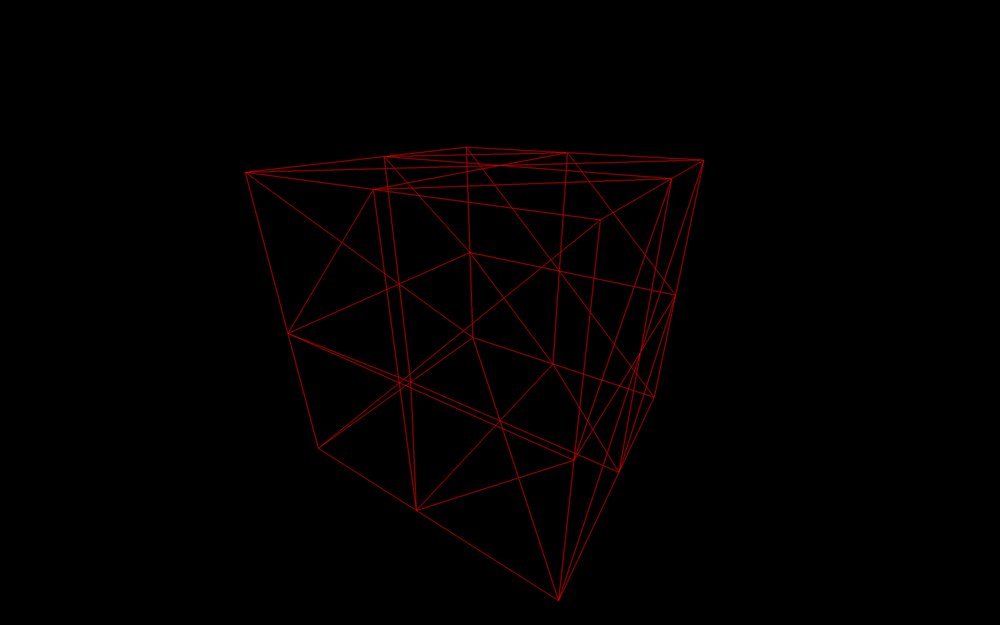
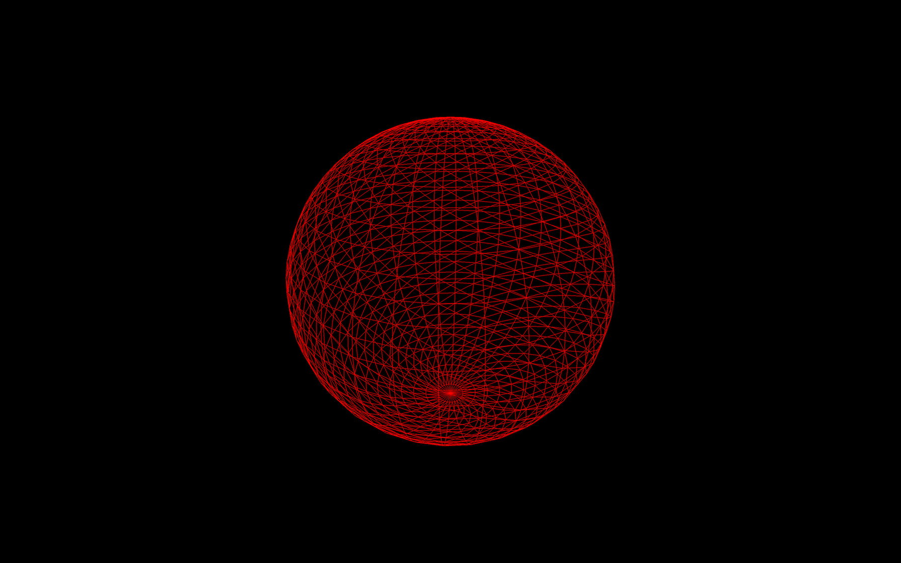
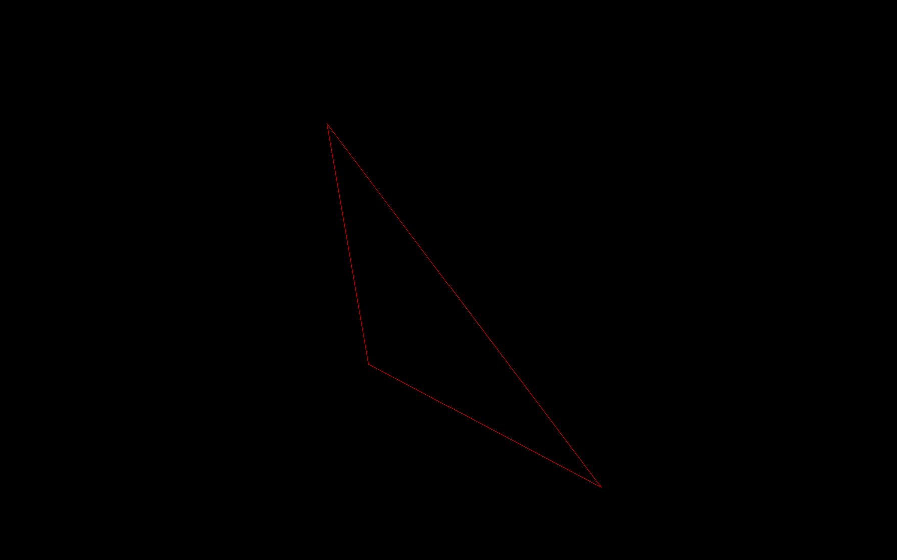
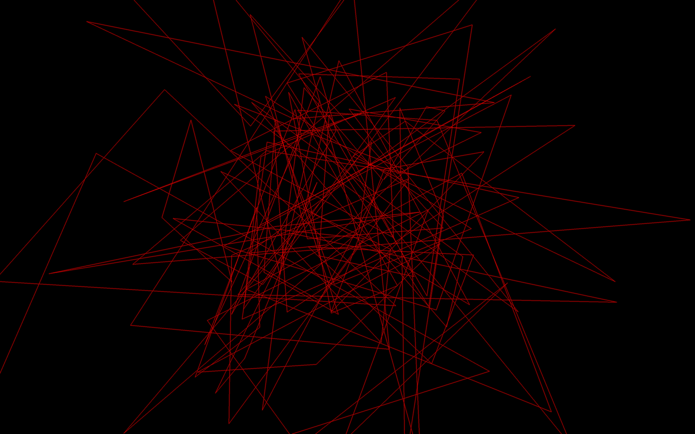

# Geometries

[](https://shields.io)

Learn in [https://threejs-journey.xyz/lessons/9](https://threejs-journey.xyz/lessons/9)

## Introduction

Until now, we only used the [BoxGeometry](https://threejs.org/docs/#api/en/geometries/BoxGeometry) class to create our cube. In this lesson, we will discover various other geometries, but first, we need to understand what a geometry really is.

## What is a geometry?

In Three.js, geometries are composed of vertices (point coordinates in 3D spaces) and faces (triangles that join those vertices to create a surface).

We use geometries to create meshes, but you can also use geometries to form particles. Each vertex (singular of vertices) will correspond to a particle, but this is for a future lesson.

We can store more data than the position in the vertices. A good example would be to talk about the UV coordinates or the normals. As you'll see, we will learn more about those later.

## The different built-in geometries

Three.js has many built-in geometries. While you don't need to know precisely how to instantiate each one, it is good to know that they exist.

All the built-in geometries we are going to see inherit from the [BufferGeometry](https://threejs.org/docs/#api/en/core/BufferGeometry) class. This class has many built in methods like `translate(...)`, `rotateX(...)`, `normalize()`, etc. but we are not going to use them in this lesson.

Most of the geometries documentation pages have examples.

- [BoxGeometry](https://threejs.org/docs/#api/en/geometries/BoxGeometry)
  To create a box.
- [PlaneGeometry](https://threejs.org/docs/#api/en/geometries/PlaneGeometry)
  To create a rectangle plane.
- [CircleGeometry](https://threejs.org/docs/#api/en/geometries/CircleGeometry)
  To create a disc or a portion of a disc (like a pie chart).
- [ConeGeometry](https://threejs.org/docs/#api/en/geometries/ConeGeometry)
  To create a cone or a portion of a cone. You can open or close the base of the cone.
- [CylinderGeometry](https://threejs.org/docs/#api/en/geometries/CylinderGeometry)
  To create a cylinder. You can open or close the ends of the cylinder and you can change the radius of each end.
- [RingGeometry](https://threejs.org/docs/#api/en/geometries/RingGeometry)
  To create a flat ring or portion of a flat circle.
- [TorusGeometry](https://threejs.org/docs/#api/en/geometries/TorusGeometry)
  To create a ring that has a thickness (like a donut) or portion of a ring.
- [TorusKnotGeometry](https://threejs.org/docs/#api/en/geometries/TorusKnotGeometry)
  To create some sort of knot geometry.
- [DodecahedronGeometry](https://threejs.org/docs/#api/en/geometries/DodecahedronGeometry)
  To create a 12 faces sphere. You can add details for a rounder sphere.
- [OctahedronGeometry](https://threejs.org/docs/#api/en/geometries/OctahedronGeometry)
  To create a 8 faces sphere. You can add details for a rounder sphere.
- [TetrahedronGeometry](https://threejs.org/docs/#api/en/geometries/TetrahedronGeometry)
  To create a 4 faces sphere (it won't be much of a sphere if you don't increase details). You can add details for a rounder sphere.
- [IcosahedronGeometry](https://threejs.org/docs/#api/en/geometries/IcosahedronGeometry)
  To create a sphere composed of triangles that have roughly the same size.
- [SphereGeometry](https://threejs.org/docs/#api/en/geometries/SphereGeometry)
  To create the most popular type of sphere where faces looks like quads (quads are just a combination of two triangles).
- [ShapeGeometry](https://threejs.org/docs/#api/en/geometries/ShapeGeometry)
  To create a shape based on a path.
- [TubeGeometry](https://threejs.org/docs/#api/en/geometries/TubeGeometry)
  To create a tube following a path.
- [ExtrudeGeometry](https://threejs.org/docs/#api/en/geometries/ExtrudeGeometry)
  To create an extrusion based on a path. You can add and control the bevel.
- [LatheGeometry](https://threejs.org/docs/#api/en/geometries/LatheGeometry)
  To create a vase or portion of a vase (more like a revolution).
- [TextGeometry](https://threejs.org/docs/#api/en/geometries/TextGeometry)
  To create a 3D text. You'll have to provide the font in typeface json format.

If you need a particular geometry that is not supported by Three.js, you can create your own geometry in JavaScript, or you can make it in a 3D software, export it and import it into your project. We will learn more about that later.

## Box example

We already made a cube but we didn't talk much about the parameters. Most geometries have parameters, and you should always take a look at the documentation before using it.

The [BoxGeometry](https://threejs.org/docs/#api/en/geometries/BoxGeometry) has 6 parameters:

- `width`: The size on the `x` axis
- `height`: The size on the `y` axis
- `depth`: The size on the `z` axis
- `widthSegments`: How many subdivisions in the `x` axis
- `heightSegments`: How many subdivisions in the `y` axis
- `depthSegments`: How many subdivisions in the `z` axis

Subdivisions correspond to how much triangles should compose the face. By default it's `1`, meaning that there will only be 2 triangles per face. If you set the subdivision to `2`, you'll end up with 8 triangles per face:

```js
const geometry = new THREE.BoxGeometry(1, 1, 1, 2, 2, 2)
```

The problem is that we cannot see these triangles.

A good solution is to add `wireframe: true` to our material. The wireframe will show the lines that delimit each triangle:

```js
const material = new THREE.MeshBasicMaterial({ color: 0xff0000, wireframe: true })
```



As you can see, there are 8 triangles by face.

While this is not relevant for a flat face cube, it gets more interesting when using a [SphereGeometry](https://threejs.org/docs/#api/en/geometries/SphereGeometry):

```js
const geometry = new THREE.SphereGeometry(1, 32, 32)
```



The more subdivisions we add, the less we can distinguish the faces. But keep in mind that too many vertices and faces will affect performances.

## Creating your own buffer geometry

Sometimes, we need to create our own geometries. If the geometry is very complex or with a precise shape, it's better to create it in a 3D software (and we will cover that in a future lesson), but if the geometry isn't too complex, we can build it ourself by using [BufferGeometry](https://threejs.org/docs/#api/en/core/BufferGeometry).

To create your own buffer geometry, start by instantiating an empty [BufferGeometry](https://threejs.org/docs/#api/en/core/BufferGeometry). We will create a simple triangle:

To add vertices to a [BufferGeometry](https://threejs.org/docs/#api/en/core/BufferGeometry) you must start with a [Float32Array](https://developer.mozilla.org/docs/Web/JavaScript/Reference/Global_Objects/Float32Array).

[Float32Array](https://developer.mozilla.org/docs/Web/JavaScript/Reference/Global_Objects/Float32Array) are native JavaScript typed array. You can only store floats inside, and the length of that array is fixed.

To create a [Float32Array](https://developer.mozilla.org/docs/Web/JavaScript/Reference/Global_Objects/Float32Array), you can specify its length and then fill it later:

```js
const positionsArray = new Float32Array(9)

// First vertice
positionsArray[0] = 0
positionsArray[1] = 0
positionsArray[2] = 0

// Second vertice
positionsArray[3] = 0
positionsArray[4] = 1
positionsArray[5] = 0

// Third vertice
positionsArray[6] = 1
positionsArray[7] = 0
positionsArray[8] = 0
```

Or you can pass an array:

```js
const positionsArray = new Float32Array([
    0, 0, 0, // First vertex
    0, 1, 0, // Second vertex
    1, 0, 0  // Third vertex
])
```

As you can see, the coordinates of the vertices are specified linearly. The array is a one-dimensional array where you specify the `x`, `y`, and `z` of the first vertex, followed by the `x`, `y`, and `z` of the second vertex, and so on.

Before you can send that array to the [BufferGeometry](https://threejs.org/docs/#api/en/core/BufferGeometry), you have to transform it into a [BufferAttribute](https://threejs.org/docs/#api/en/core/BufferAttribute).

The first parameter corresponds to your typed array and the second parameter corresponds to how much values make one vertex attribute. As we saw earlier, to read this array, we have to go 3 by 3 because a vertex position is composed of 3 values (`x`, `y` and `z`):

```js
const positionsAttribute = new THREE.BufferAttribute(positionsArray, 3)
```

Then we can add this attribute to our [BufferGeometry](https://threejs.org/docs/#api/en/core/BufferGeometry) using the `setAttribute(...)` method. The first parameter is the name of this attribute and the second parameter is the value:

```js
geometry.setAttribute('position', positionsAttribute)
```

We chose `'position'` as the name because Three.js internal shaders will look for that value to position the vertices. We will see more about that in the shaders lessons.

The faces will be automatically created following the order of the vertices.

All together:

```js
// Create an empty BufferGeometry
const geometry = new THREE.BufferGeometry()

// Create a Float32Array containing the vertices position (3 by 3)
const positionsArray = new Float32Array([
    0, 0, 0, // First vertex
    0, 1, 0, // Second vertex
    1, 0, 0  // Third vertex
])

// Create the attribute and name it 'position'
const positionsAttribute = new THREE.BufferAttribute(positionsArray, 3)
geometry.setAttribute('position', positionsAttribute)
```



We can also create a bunch of random triangles:

```js
// Create an empty BufferGeometry
const geometry = new THREE.BufferGeometry()

// Create 50 triangles (450 values)
const count = 50
const positionsArray = new Float32Array(count * 3 * 3)
for(let i = 0; i < count * 3 * 3; i++)
{
    positionsArray[i] = (Math.random() - 0.5) * 4
}

// Create the attribute and name it 'position'
const positionsAttribute = new THREE.BufferAttribute(positionsArray, 3)
geometry.setAttribute('position', positionsAttribute)
```



The only difficulty might be the `count * 3 * 3` part but it's quite simple to explain: We need `50` triangles. Each triangle is composed of `3` vertices and each vertex is composed of `3` values (`x`, `y`, and `z`).

#### Index

One interesting thing with [BufferGeometry](https://threejs.org/docs/#api/en/core/BufferGeometry) is that you can mutualize vertices using the `index` property. Consider a cube. Multiple faces can use some vertices like the ones in the corners. And if you look closely, every vertex can be used by various neighbor triangles. That will result in a smaller attribute array and performance improvement. But we won't cover this part in that lesson.
