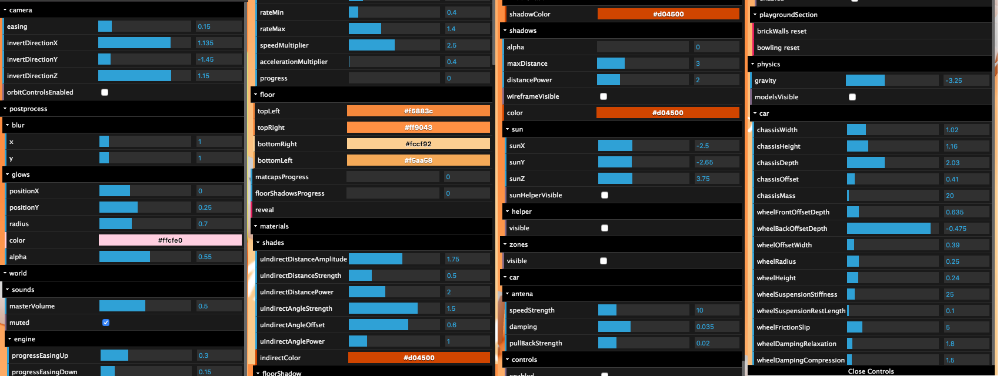
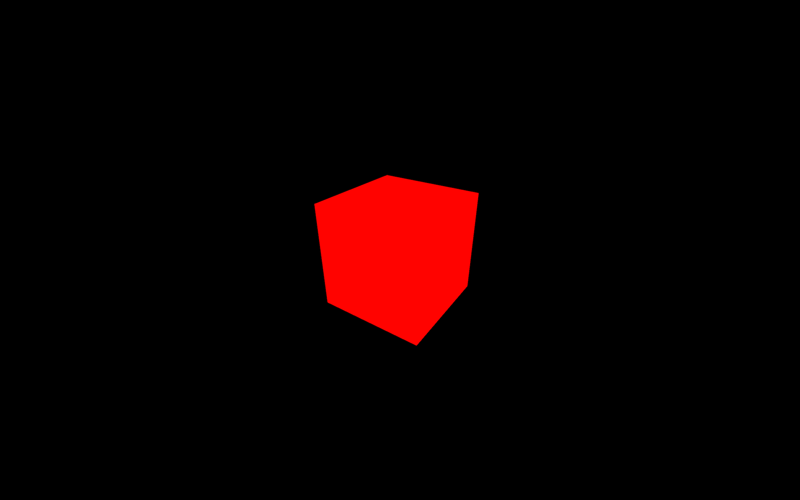
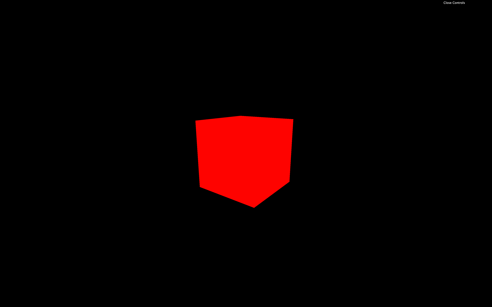
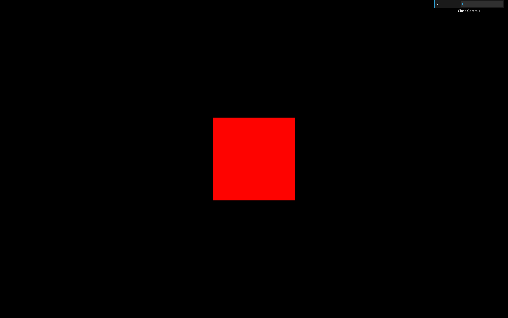
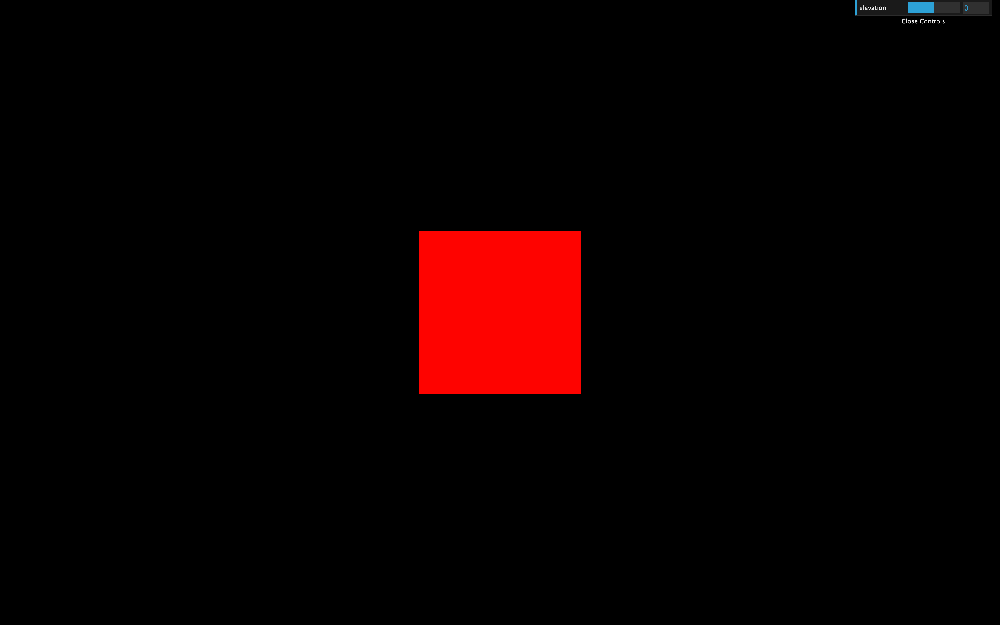
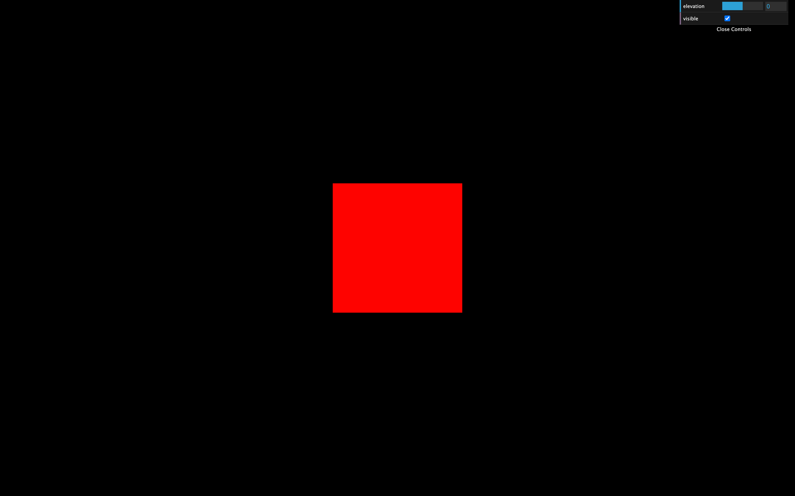
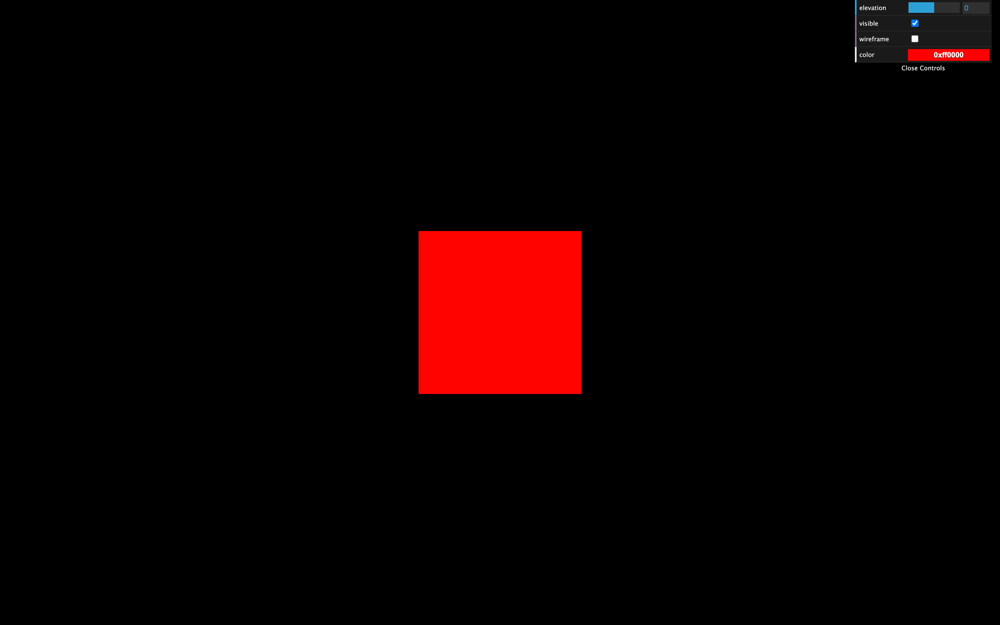
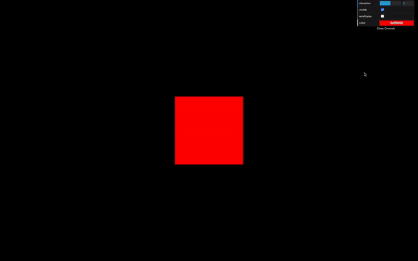
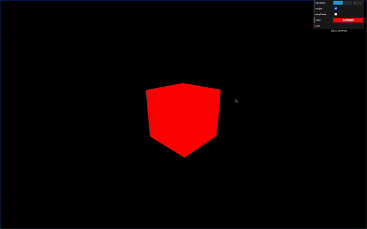

# Debug UI

[](https://shields.io)

Learn in [https://threejs-journey.xyz/lessons/10](https://threejs-journey.xyz/lessons/10)

## Introduction

An essential aspect of every creative project is making debugging easy and tweaking your code. The developer (you) and other actors working on the project (like designers or even the client) must be able to change as many parameters as possible.

You have to take this into account for them to find the perfect color, speed, quantity, etc. for the best experience. You might even get unexpected results that look great.

First, we need a debug UI.

While you can create your own debug UI using HTML / CSS / JS, there are already multiple libraries:

- [dat.GUI](https://github.com/dataarts/dat.gui)
- [control-panel](https://github.com/freeman-lab/control-panel)
- [ControlKit](https://github.com/automat/controlkit.js)
- [Guify](https://github.com/colejd/guify)
- [Oui](https://github.com/wearekuva/oui)

All of these can do what we want, but we will use the most popular one, which is [dat.GUI](https://github.com/dataarts/dat.gui). Feel free to try the other ones.

## Example

You can find a pretty good example of debug UI on my portfolio. This UI only shows up when you add `#debug` to the URL.

[https://bruno-simon.com/#debug](https://bruno-simon.com/#debug)



You can tweak the gravity, the colors, the speed, the elements position, etc.

While it took me a lot of time to create all those tweaks, the game would appear less balanced without it.

## Setup

In the starter, we have our cube, but the dependencies don't include Dat.GUI. We will add it and create some tweaks.



## How to implement Dat.GUI

To add Dat.GUI to our Webpack project, we can use the dependency manager provided with Node.js called NPM (just like we did for GSAP in a previous lesson).

In your terminal (while the server is not running or by using another terminal window on the same folder) run `npm install --save dat.gui`

Dat.GUI is now available in the `/node_modules/` folder and we can import it in our `script.js`. Don't forget to relaunch the server:

```js
import './style.css'
import * as THREE from 'three'
import { OrbitControls } from 'three/examples/jsm/controls/OrbitControls.js'
import gsap from 'gsap'
import * as dat from 'dat.gui'

// ...
```

You can now instantiate Dat.GUI:

```js
/**
 * Debug
 */
const gui = new dat.GUI()
```



This will result in an empty panel on the top right corner of the screen.

There are different types of elements you can add to that panel:

- **Range** —for numbers with minimum and maximum value
- **Color** —for colors with various formats
- **Text** —for simple texts
- **Checkbox** —for booleans (`true` or `false`)
- **Select** —for a choice from a list of values
- **Button** —to trigger functions
- **Folder** —to organize your panel if you have too many elements

Let's see some of those.

#### Add elements

To add an element to the panel, you must use `gui.add(...)`. The first parameter is an object and the second parameter is the property of that object you want to tweak. You need to set it after you created the concerned object:

```js
gui.add(mesh.position, 'y')
```



A range should appears in the panel. Try to change it and watch the cube moving accordingly.

To specify the minimum value, the maximum value and the precision, you can set them in the parameters:

```js
gui.add(mesh.position, 'y', - 3, 3, 0.01)
```


Or you can use the methods `min(...)`, `max(...)` and `step(...)` by chaining directly after the `add(...)` method:

```js
gui.add(mesh.position, 'y').min(- 3).max(3).step(0.01)
```

If you don't like having too many methods chained in one line, you can simply add line breaks:

```js
gui
    .add(mesh.position, 'y')
    .min(- 3)
    .max(3)
    .step(0.01)
```

To change the label, use the the `name(...)` method:

```js
gui
    .add(mesh.position, 'y')
    .min(- 3)
    .max(3)
    .step(0.01)
    .name('elevation')
```



Dat.GUI will automatically detect what kind of property you want to tweak and use the corresponding element. A good example is the `visible` property of [Object3D](https://threejs.org/docs/#api/en/core/Object3D.visible). It is a boolean that, if `false`, will hide the object:

```js
gui.add(mesh, 'visible')
```



As you can see, Dat.GUI chose a checkbox because the `visible` property is a boolean.

We can do the same with the `wireframe` property of the material:

```js
gui.add(material, 'wireframe')
```


#### Colors

Handling colors is a little harder.

First, we need to use `addColor(...)` instead of `add(...)`. This is due to Dat.GUI not being able to know if you want to tweak a text, a number or a color just by the type of the property.

Secondly, you'll have to create an intermediate object with the color in its properties and use that property in your material. That is due to the Three.js material not having a clean and accessible value like `#ff0000`.

Create a `parameter` variable at the start of your code right after the `import` part:

```js
const parameters = {
    color: 0xff0000
}
```

Then, after instantiating your `gui` variable, add the following tweak:

```js
gui.addColor(parameters, 'color')
```



You should see a color picker in your panel. The problem is that changing this color doesn't affect the material. It does change the `color` property of the `parameter` variable, but we don't even use that variable in our material.

To fix that, we need Dat.GUI to alert us when the value changed. We can do that by chaining the `onChange(...)` method and updating the material color using `material.color.set(...)`. This method is very useful because of how many formats you can use like `'#ff0000'`, `'#f00'`, `0xff0000` or even `'red'`:

```js
const parameters = {
    color: 0xff0000
}

// ...

gui
    .addColor(parameters, 'color')
    .onChange(() =>
    {
        material.color.set(parameters.color)
    })
```



_https://threejs-journey.xyz/assets/lessons/10/step-09.mp4_

Currently, the `0xff0000` color is specified at two places: in the `parameters` object and in the `material`.

While it's not a big deal, if we want to change the color, we'll have to do it at those two places.

Let's simply fix that by using the `parameters.color` property in our material:

```js
const material = new THREE.MeshBasicMaterial({ color: parameters.color })
```

#### Functions

To trigger a function, like the color value, we must add that function to an object. We can use the `parameters` object we created earlier to add a `spin` property containing the function that will animate the cube:

```js
const parameters = {
    color: 0xff0000,
    spin: () =>
    {
        gsap.to(mesh.rotation, { duration: 1, y: mesh.rotation.y + Math.PI * 2 })
    }
}
```

And again, we can add the tweak to our `gui` after instantiating it:

```js
gui.add(parameters, 'spin')
```



_https://threejs-journey.xyz/assets/lessons/10/step-10.mp4_

You should see a `spin` button, and clicking on it will result on your cube doing a 360 rotation.

## Tips

#### Hide

Press `H` to hide the panel.

If you want the panel to be hidden from start, call `gui.hide()` after instantiating it.

#### Close

You can close the panel by clicking on its bottom part.

If you want the panel to be closed by default, you can send an object when instantiating Dat.GUI and pass it `closed: true` in its properties:

```js
const gui = new dat.GUI({ closed: true })
```

#### Width

You can change the panel's width by drag and dropping its left border (although please note, it doesn't always work).

If you want to change the default width of the panel, add `width: ...` in the properties:

```js
const gui = new dat.GUI({ width: 400 })
```

If you want to know more about Dat.GUI, here are some links:

- Github repository: [https://github.com/dataarts/dat.gui](https://github.com/dataarts/dat.gui)
- API documentation: [https://github.com/dataarts/dat.gui/blob/HEAD/API.md](https://github.com/dataarts/dat.gui/blob/HEAD/API.md)
- A simple but complete example: [https://jsfiddle.net/ikatyang/182ztwao/](https://jsfiddle.net/ikatyang/182ztwao/)

## How and when to use it

We will use our debug panel at specific moments of the next exercises. But feel free to add as many tweaks as you want. It's an excellent way to practice and to start building some creative stuff.

I would recommend you to add tweaks as you progress. If you think of adding all the tweaks at the end of the project, you'll probably end up with no tweak at all.
