# Textures

[](https://shields.io)

Learn in [https://threejs-journey.xyz/lessons/11](https://threejs-journey.xyz/lessons/11)

## Introduction

Bored with your red cube yet? It's time to add some textures.

But first, what are textures and what can we really do with them?

## What are textures?

Textures, as you probably know, are images that will cover the surface of your geometries. Many types of textures can have different effects on the appearance of your geometry. It's not just about the color.

Here are the most common types of textures using a famous [door texture](https://3dtextures.me/2019/04/16/door-wood-001/) by João Paulo. Buy him a [Ko-fi](https://ko-fi.com/katsukagi) or become a [Patreon](https://www.patreon.com/gendo) if you like his work.

- **Color** (or albedo)
  The albedo texture is the most simple one. It'll only take the pixels of the texture and apply them to the geometry.

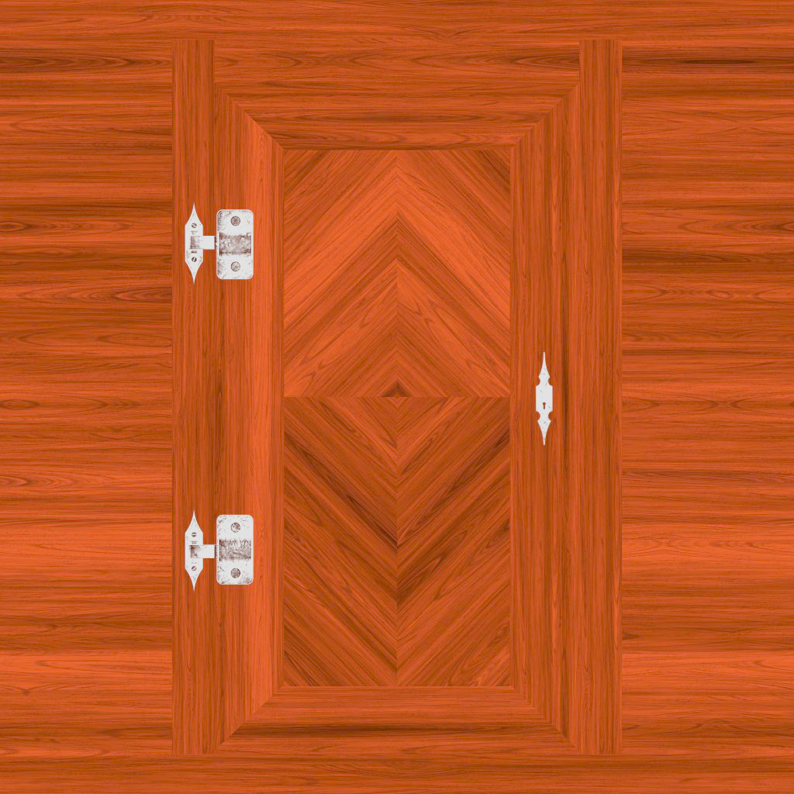

- **Alpha**
  The alpha texture is a grayscale image where white will be visible, and black won't.


- **Height**
  The height texture is a grayscale image that will move the vertices to create some relief. You'll need to add subdivision if you want to see it.

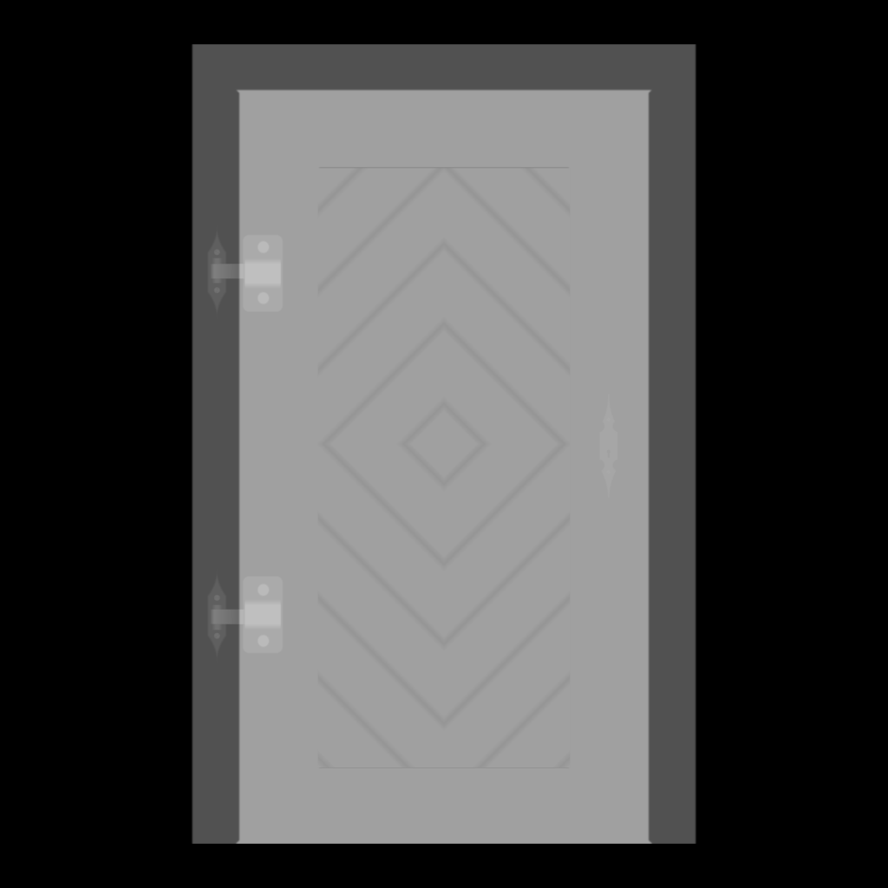

- **Normal**
  The normal texture will add small details. It won't move the vertices, but it will lure the light into thinking that the face is oriented differently. Normal textures are very useful to add details with good performance because you don't need to subdivide the geometry.


- **Ambient occlusion**
  The ambient occlusion texture is a grayscale image that will fake shadow in the surface's crevices. While it's not physically accurate, it certainly helps to create contrast.


- **Metalness**
  The metalness texture is a grayscale image that will specify which part is metallic (white) and non-metallic (black). This information will help to create reflection.


- **Roughness**
  The roughness is a grayscale image that comes with metalness, and that will specify which part is rough (white) and which part is smooth (black). This information will help to dissipate the light. A carpet is very rugged, and you won't see the light reflection on it, while the water's surface is very smooth, and you can see the light reflecting on it. Here, the wood is uniform because there is a clear coat on it.


#### PBR

Those textures (especially the metalness and the roughness) follow what we call PBR principles. PBR stands for Physically Based Rendering. It regroups many techniques that tend to follow real-life directions to get realistic results.

While there are many other techniques, PBR is becoming the standard for realistic renders, and many software, engines, and libraries are using it.

For now, we will simply focus on how to load textures, how to use them, what transformations we can apply, and how to optimize them. We will see more about PBR in later lessons, but if you're curious, you can learn more about it here:

- [https://marmoset.co/posts/basic-theory-of-physically-based-rendering/](https://marmoset.co/posts/basic-theory-of-physically-based-rendering/)
- [https://marmoset.co/posts/physically-based-rendering-and-you-can-too/](https://marmoset.co/posts/physically-based-rendering-and-you-can-too/)

## How to load textures

### Getting the URL of the image

To load the texture, we need the URL of the image file.

Because we are using Webpack, there are two ways of getting it.

You can put the image texture in the `/src/` folder and import it like you would import a JavaScript dependency:

```js
import imageSource from './image.png'

console.log(imageSource)
```

Or you can put that image in the `/static/` folder and access it just by adding the path of the image (without `/static`) to the URL:

```js
const imageSource = '/image.png'

console.log(imageSource)
```

Be careful, this `/static/` folder only works because of the Webpack template's configuration. If you are using other types of bundler, you might need to adapt your project.

We will use the `/static/` folder technique for the rest of the course.

### Loading the image

You can find the door textures we just saw in the `/static/` folder, and there are multiple ways of loading them.

#### Using native JavaScript

With native JavaScript, first, you must create an `Image` instance, listen to the `load` event, and then change its `src` property to start loading the image:

```js
const image = new Image()
image.onload = () =>
{
    console.log('image loaded')
}
image.src = '/textures/door/color.jpg'
```

You should see `'image loaded'` appears in the console. As you can see, we set the source to `'/textures/door/color.jpg'` without the `/static` folder in the path.

We cannot use that image directly. We need to create a [Texture](https://threejs.org/docs/index.html#api/en/textures/Texture) from that image first.

This is because WebGL needs a very specific format that can be access by the GPU and also because some changes will be applied to the textures like the mipmapping but we will see more about that a little later.

Create the texture with the [Texture](https://threejs.org/docs/#api/en/textures/Texture) class:

```js
const image = new Image()
image.addEventListener('load', () =>
{
    const texture = new THREE.Texture(image)
})
image.src = '/textures/door/color.jpg'
```

What we need to do now is use that `texture` in the `material`. Unfortunately, the `texture` variable has been declared in a function and we can not access it outside of this function. This is a JavaScript limitation called scope.

We could create the mesh inside the function, but there is a better solution consisting on creating the texture outside of the function and then updating it once the image is loaded by setting the texture `needsUpdate` property to `true`:

```js
const image = new Image()
const texture = new THREE.Texture(image)
image.addEventListener('load', () =>
{
    texture.needsUpdate = true
})
image.src = '/textures/door/color.jpg'
```

While doing this, you can immediately use the `texture` variable immediately, and the image will be transparent until it is loaded.

To see the texture on the cube, replace the `color` property by `map` and use the `texture` as value:

```js
const material = new THREE.MeshBasicMaterial({ map: texture })
```

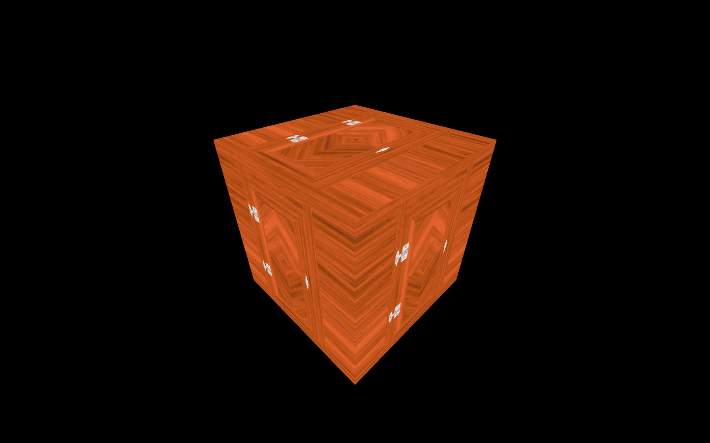

You should see the door texture on each side of your cube.

#### Using TextureLoader

The native JavaScript technique is not that complicated, but there is an even more straightforward way with [TextureLoader](https://threejs.org/docs/index.html#api/en/loaders/TextureLoader).

Instantiate a variable using the [TextureLoader](https://threejs.org/docs/index.html#api/en/loaders/TextureLoader) class and use its `.load(...)` method to create a texture:

```js
const textureLoader = new THREE.TextureLoader()
const texture = textureLoader.load('/textures/door/color.jpg')
```

Internally, Three.js will do what it did before to load the image and update the texture once it's ready.

You can load as many textures as you want with only one [TextureLoader](https://threejs.org/docs/index.html#api/en/loaders/TextureLoader) instance.

You can send 3 functions after the path. They will be called for the following events:

- `load` when the image loaded successfully
- `progress` when the loading is progressing
- `error` if something went wrong

```js
const textureLoader = new THREE.TextureLoader()
const texture = textureLoader.load(
    '/textures/door/color.jpg',
    () =>
    {
        console.log('loading finished')
    },
    () =>
    {
        console.log('loading progressing')
    },
    () =>
    {
        console.log('loading error')
    }
)
```

If the texture doesn't work, it might be useful to add those callback functions to see what is happening and spot errors.

#### Using the LoadingManager

Finally, if you have multiple images to load and want to mutualize the events like being notified when all the images are loaded, you can use a [LoadingManager](https://threejs.org/docs/index.html#api/en/loaders/managers/LoadingManager).

Create an instance of the [LoadingManager](https://threejs.org/docs/index.html#api/en/loaders/managers/LoadingManager) class and pass it to the [TextureLoader](https://threejs.org/docs/index.html#api/en/loaders/TextureLoader):

```js
const loadingManager = new THREE.LoadingManager()
const textureLoader = new THREE.TextureLoader(loadingManager)
```

You can listen to the various events by replacing the following properties by your own functions `onStart`, `onLoad`, `onProgress`, and `onError`:

```js
const loadingManager = new THREE.LoadingManager()
loadingManager.onStart = () =>
{
    console.log('loading started')
}
loadingManager.onLoaded = () =>
{
    console.log('loading finished')
}
loadingManager.onProgress = () =>
{
    console.log('loading progressing')
}
loadingManager.onError = () =>
{
    console.log('loading error')
}

const textureLoader = new THREE.TextureLoader(loadingManager)
```

You can now start loading all the images you need:

```js
// ...

const colorTexture = textureLoader.load('/textures/door/color.jpg')
const alphaTexture = textureLoader.load('/textures/door/alpha.jpg')
const heightTexture = textureLoader.load('/textures/door/height.jpg')
const normalTexture = textureLoader.load('/textures/door/normal.jpg')
const ambientOcclusionTexture = textureLoader.load('/textures/door/ambientOcclusion.jpg')
const metalnessTexture = textureLoader.load('/textures/door/metalness.jpg')
const roughnessTexture = textureLoader.load('/textures/door/roughness.jpg')
```

Has you can see here, we renamed the `texture` variable `colorTexture` so don't forget to change it in the `material` too:

```js
const material = new THREE.MeshBasicMaterial({ map: colorTexture })
```

The [LoadingManager](https://threejs.org/docs/index.html#api/en/loaders/managers/LoadingManager) is very useful if you want to show a loader and hide it only when all the assets are loaded. As we will see in a future lesson, you can also use it with other types of loaders.

## UV unwrapping

While it is quite logical how to place a texture on a cube, things can be a little trickier for other geometries.

Try to replace your BoxGeometry with other geometries:

```js
const geometry = new THREE.BoxGeometry(1, 1, 1)

// Or
const geometry = new THREE.SphereGeometry(1, 32, 32)

// Or
const geometry = new THREE.ConeGeometry(1, 1, 32)

// Or
const geometry = new THREE.TorusGeometry(1, 0.35, 32, 100)
```

As you can see, the texture is being stretched or squeezed in different ways to cover the geometry.

That is called **UV unwrapping**. You can imagine that like unwrapping an origami or a candy wrap to make it flat. Each vertex will have a 2D coordinate on a flat (usually square) plane.

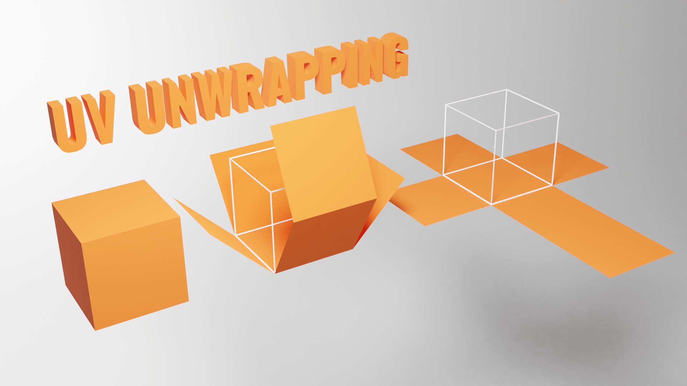

You can actually see those UV 2D coordinates in the `geometry.attributes.uv` property:

```js
console.log(geometry.attributes.uv)
```

Those UV coordinates are generated by Three.js when you use the primitives. If you create your own geometry and want to apply a texture to it, you'll have to specify the UV coordinates.

If you are making the geometry using a 3D software, you'll also have to do the UV unwrapping.

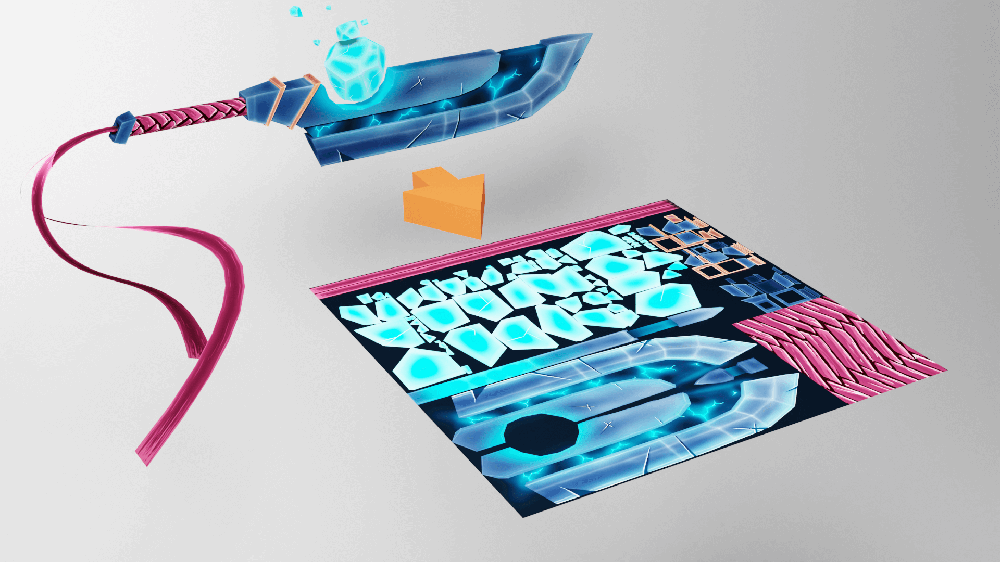

Don't worry; most 3D software also has auto unwrapping that should do the trick.

## Transforming the texture

Let's get back to our cube with one texture and see what kind of transformations we can apply to that texture.

#### Repeat

You can repeat the texture using the `repeat` property, which is a [Vector2](https://threejs.org/docs/index.html#api/en/math/Vector2), meaning that it has `x` and `y` properties.

Try to change these properties:

```js
const colorTexture = textureLoader.load('/textures/door/color.jpg')
colorTexture.repeat.x = 2
colorTexture.repeat.y = 3
```

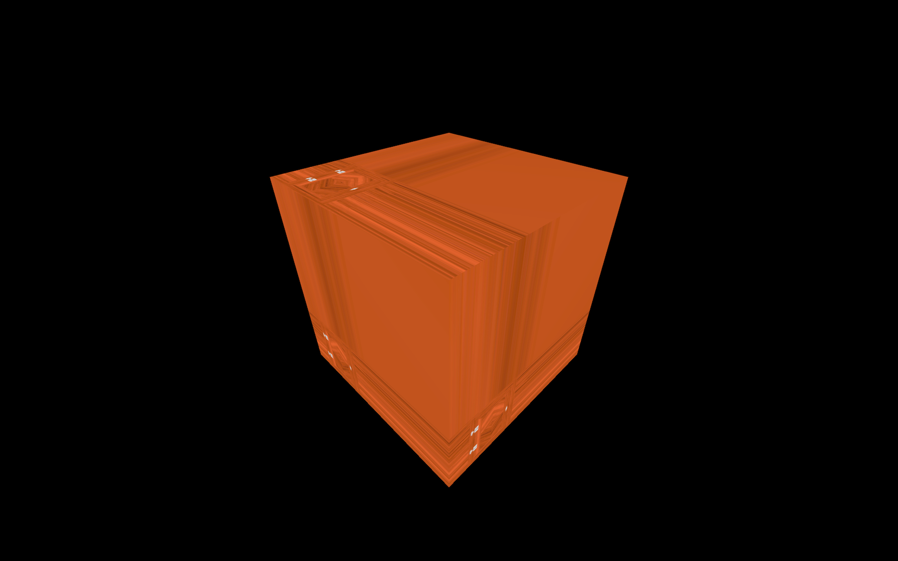

As you can see, the texture is not repeating, but it is smaller, and the last pixel seems stretched.

That is due to the texture not being set up to repeat itself by default. To change that, you have to update the `wrapS` and `wrapT` properties using the `THREE.RepeatWrapping` constant.

- `wrapS` is for the `x` axis
- `wrapT` is for the `y` axis

```js
colorTexture.wrapS = THREE.RepeatWrapping
colorTexture.wrapT = THREE.RepeatWrapping
```

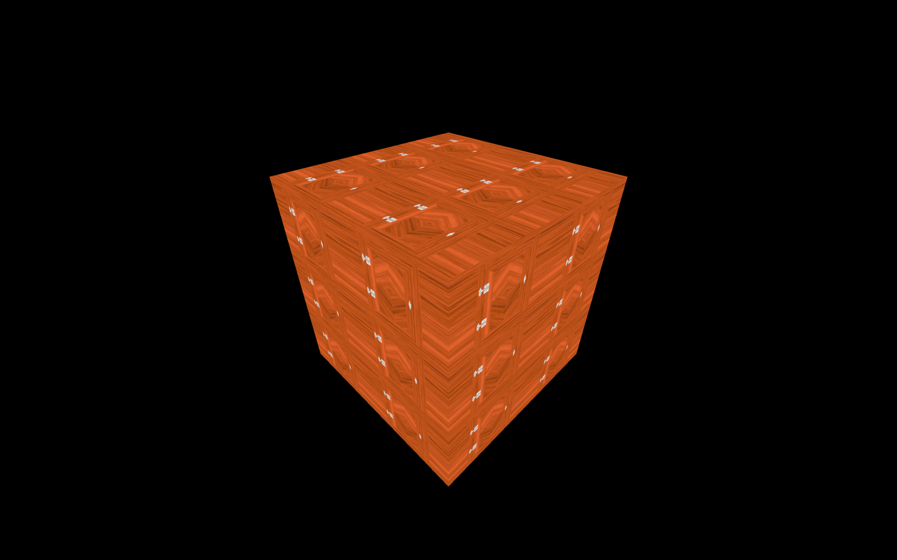

You can also alternate the direction with `THREE.MirroredRepeatWrapping`:

```js
colorTexture.wrapS = THREE.MirroredRepeatWrapping
colorTexture.wrapT = THREE.MirroredRepeatWrapping
```

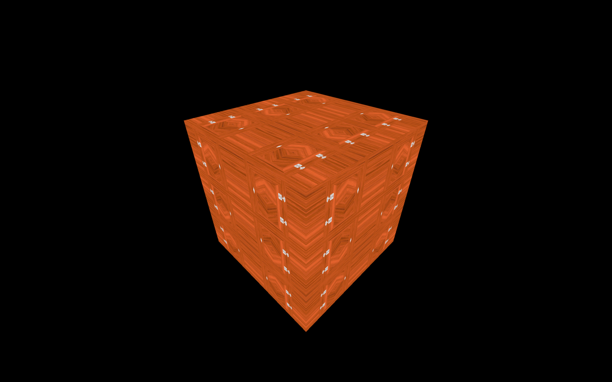

#### Offset

You can offset the texture using the `offset` property that is also a [Vector2](https://threejs.org/docs/index.html#api/en/math/Vector2) with `x` and `y` properties. Changing these will simply offset the UV coordinates:

```js
colorTexture.offset.x = 0.5
colorTexture.offset.y = 0.5
```

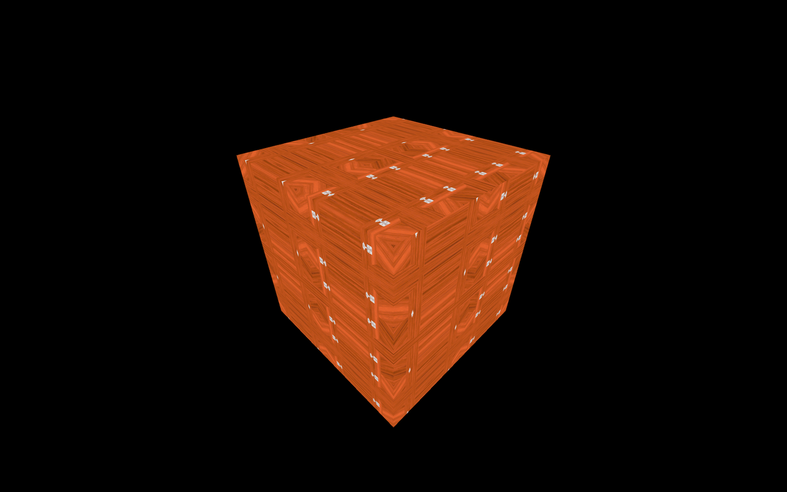

#### Rotation

You can rotate the texture using the `rotation` property, which is a simple number corresponding to the angle in radians:

```js
colorTexture.rotation = Math.PI * 0.25
```

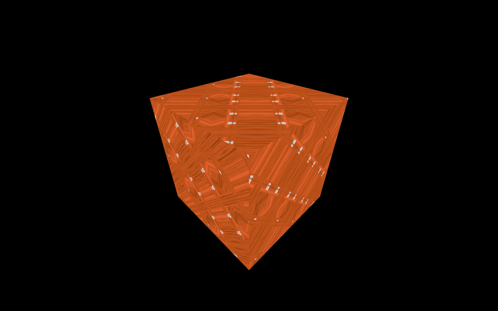

If you remove the `offset` and `repeat` properties, you'll see that the rotation occurs around the bottom left corner of the cube's faces:

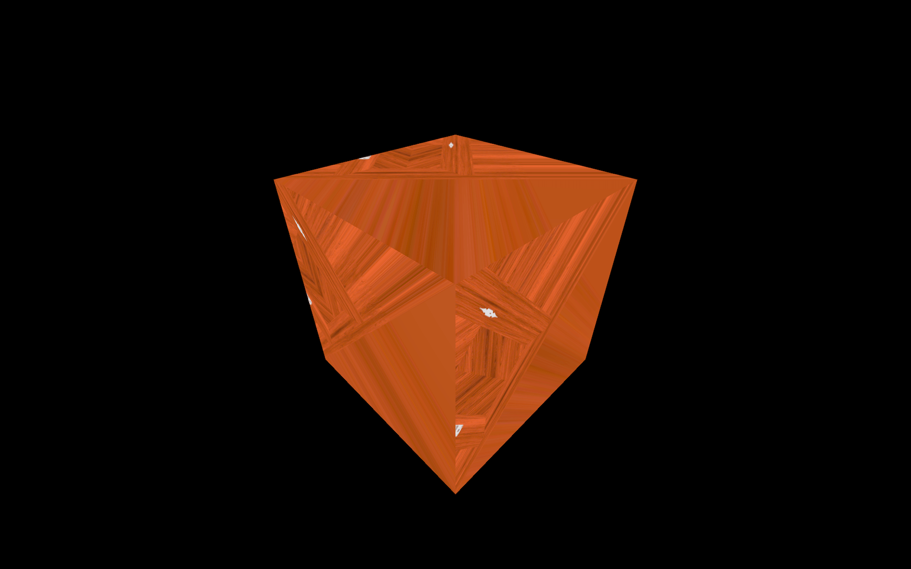

That is, in fact, the `0, 0` UV coordinates. If you want to change the pivot of that rotation, you can do it using the `center` property which is also a [Vector2](https://threejs.org/docs/index.html#api/en/math/Vector2):

```js
colorTexture.rotation = Math.PI * 0.25
colorTexture.center.x = 0.5
colorTexture.center.y = 0.5
```

The texture will now rotate on its center.

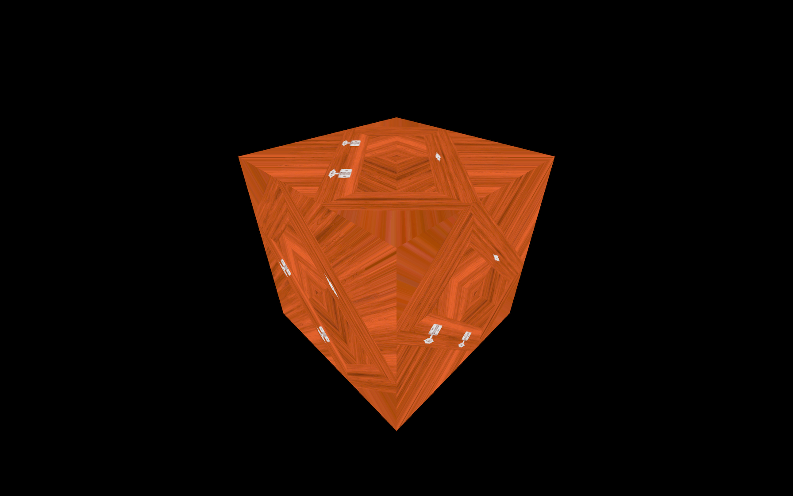

## Filtering and Mipmapping

If you look at the cube's top face while this face is almost hidden, you'll see a very blurry texture.

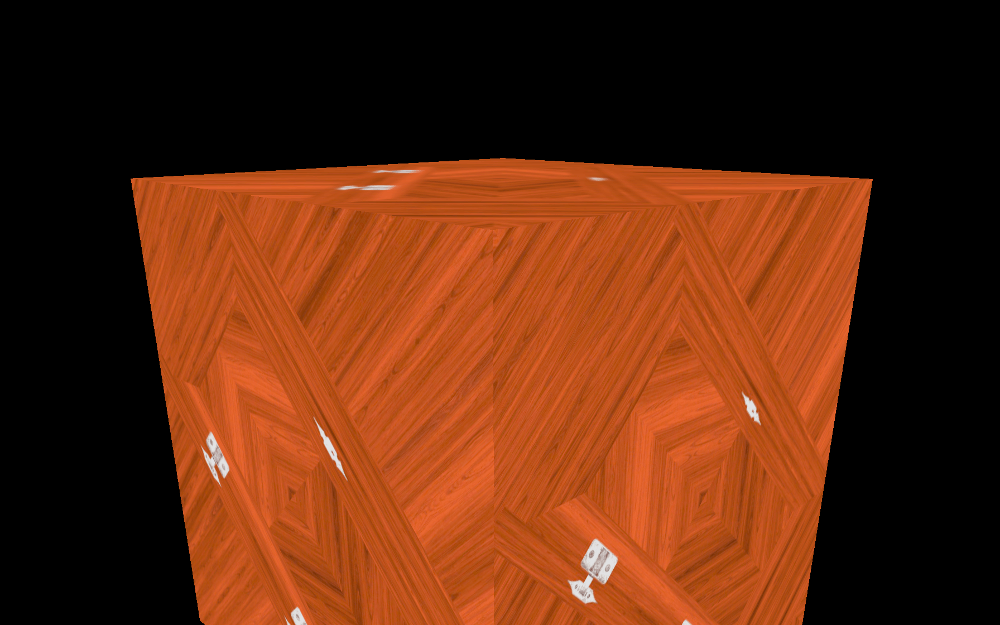

That is due to the filtering and the mipmapping.

Mipmapping (or "mip mapping" with a space) is a technique that consists of creating half a smaller version of a texture again and again until you get a 1x1 texture. All those texture variations are sent to the GPU, and the GPU will choose the most appropriate version of the texture.

Three.js and the GPU already handle all of this, and you can just set what filter algorithm to use. There are two types of filter algorithms: the minification filter and the magnification filter.

#### Minification filter

The minification filter happens when the pixels of texture are smaller than the pixels of the render. In other words, the texture is too big for the surface, it covers.

You can change the minification filter of the texture using the `minFilter` property.

There are 6 possible values:

- `THREE.NearestFilter`
- `THREE.LinearFilter`
- `THREE.NearestMipmapNearestFilter`
- `THREE.NearestMipmapLinearFilter`
- `THREE.LinearMipmapNearestFilter`
- `THREE.LinearMipmapLinearFilter`

The default is `THREE.LinearMipmapLinearFilter`. If you are not satisfied with how you texture looks, you should try the other filters.

We won't see each one, but we will test the `THREE.NearestFilter`, which has a very different result:

```js
colorTexture.minFilter = THREE.NearestFilter
```


_https://threejs-journey.xyz/assets/lessons/11/step-10.mp4_

If you're using a device with a pixel ratio above one, you won't see much of a difference. If not, place the camera where this face is almost hidden, and you should get more details and strange artifacts.

If you test with the `checkerboard-1024x1024.png` texture located in the `/static/textures/` folder, you will see those artefacts more clearly:

```js
const colorTexture = textureLoader.load('/textures/checkerboard-1024x1024.png')
```


_https://threejs-journey.xyz/assets/lessons/11/step-11.mp4_

The artefacts you see are are called [moiré patterns](https://en.wikipedia.org/wiki/Moir%C3%A9_pattern) and you usually want to avoid them.

#### Magnification filter

The magnification filter works just like the minification filter, but when the pixels of the texture are bigger than the render's pixels. In other words, the texture too small for the surface it covers.

You can see the result using the `checkerboard-8x8.png` texture also located in the `static/textures/` folder:

```js
const colorTexture = textureLoader.load('/textures/checkerboard-8x8.png')
```

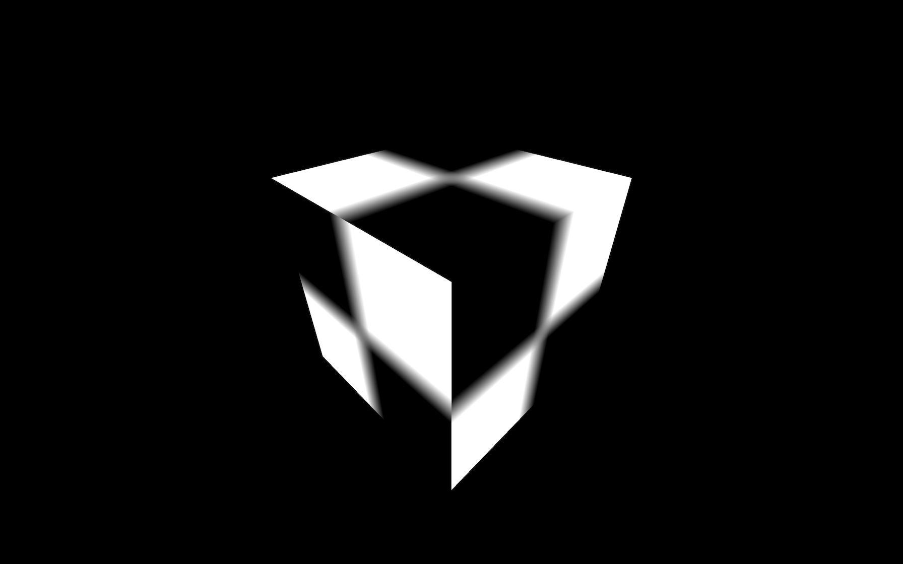

The texture gets all blurry because it's a very small texture on a very large surface.

While you might think this looks awful, it is probably for the best. If the effect isn't too exaggerated, the user will probably not even notice it.

You can change the magnification filter of the texture using the `magFilter` property.

There are only two possible values:

- `THREE.NearestFilter`
- `THREE.LinearFilter`

The default is `THREE.LinearFilter`.

If you test the `THREE.NearestFilter`, you'll see that the base image is preserved, and you get a pixelated texture:

```js
colorTexture.magFilter = THREE.NearestFilter
```


It can be advantageous if you're going for a Minecraft style with pixelated textures.

You can see the result using the `minecraft.png` texture located in the `static/textures/` folder:

```js
const colorTexture = textureLoader.load('/textures/minecraft.png')
```

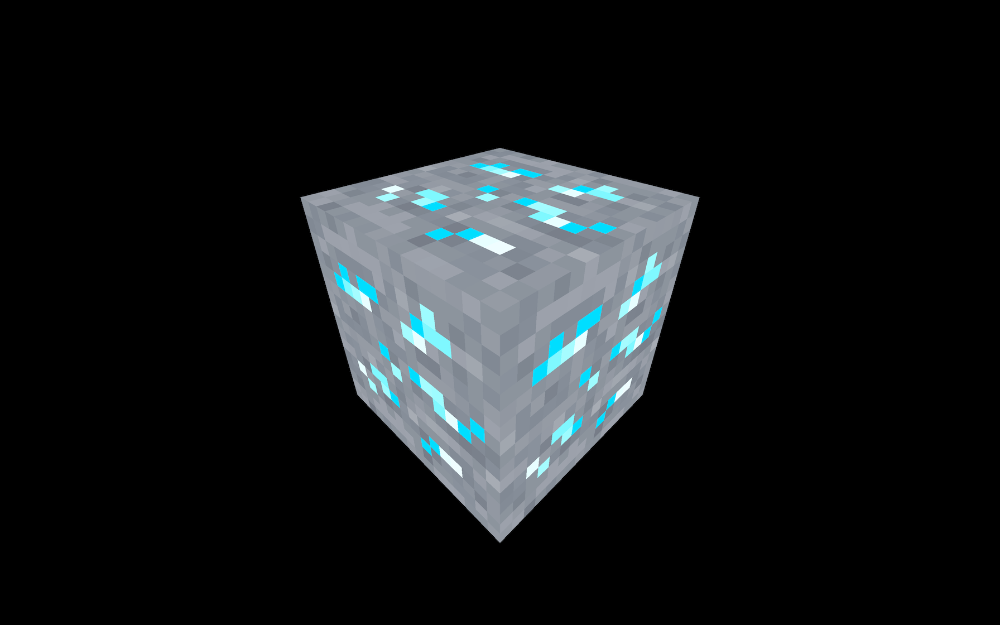

One final word about all those filters is that `THREE.NearestFilter` is cheaper than the other ones, and you should get better performances when using it.

Only use the mipmaps for the `minFilter` property. If you are using the `THREE.NearestFilter`, you don't need the mipmaps, and you can deactivate them with `colorTexture.generateMipmaps = false`:

```js
colorTexture.generateMipmaps = false
colorTexture.minFilter = THREE.NearestFilter
```

That will slightly offload the GPU.

## Texture format and optimisation

When you are preparing your textures, you must keep 3 crucial elements in mind:

- The weight
- The size (or the resolution)
- The data

#### The weight

Don't forget that the users going to your website will have to download those textures. You can use most of the types of images we use on the web like `.jpg` (lossy compression but usually lighter) or `.png` (lossless compression but usually heavier).

Try to apply the usual methods to get an acceptable image but as light as possible. You can use compression websites like [TinyPNG](https://tinypng.com/) (also works with jpg) or any software.

#### The size

Each pixel of the textures you are using will have to be stored on the GPU regardless of the image's weight. And like your hard drive, the GPU has storage limitations. It's even worse because the automatically generated mipmapping increases the number of pixels that have to be store.

Try to reduce the size of your images as much as possible.

If you remember what we said about the mipmapping, Three.js will produce a half smaller version of the texture repeatedly until it gets a 1x1 texture. Because of that, your texture width and height must be a power of 2. That is mandatory so that Three.js can divide the size of the texture by 2.

Some examples: `512x512`, `1024x1024` or `512x2048`

`512`, `1024` and `2048` can be divided by 2 until it reaches 1.

If you are using a texture with a width or height different than a power of 2 value, Three.js will try to stretch it to the closest power of 2 number, which can have visually poor results, and you'll also get a warning in the console.

#### The data

We haven't tested it yet, because we have other things to see first, but textures support transparency. As you may know, jpg files don't have an alpha channel, so you might prefer using a png.

Or you can use an alpha map, as we will see in a future lesson.

If you are using a normal texture (the purple one), you will probably want to have the exact values for each pixel's red, green, and blue channels, or you might end up with visual glitches. For that, you'll need to use a png because its lossless compression will preserve the values.

## Where to find textures

Unfortunately, it's always hard to find the perfect textures. There are many websites, but the textures aren't always right, and you may have to pay.

It's probably a good idea to start by searching on the web. Here are some websites I frequently end up on.

- [poliigon.com](http://poliigon.com/)
- [3dtextures.me](http://3dtextures.me/)
- [arroway-textures.ch](http://arroway-textures.ch/)

Always make sure that you have the right to use the texture if it's not for personal usage.

You can also create your own using photos and 2D software like Photoshop or even procedural textures with software like [Substance Designer](https://www.substance3d.com/products/substance-designer/).
